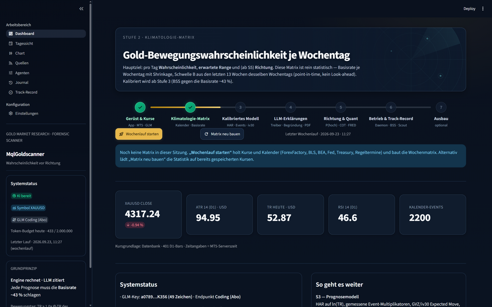
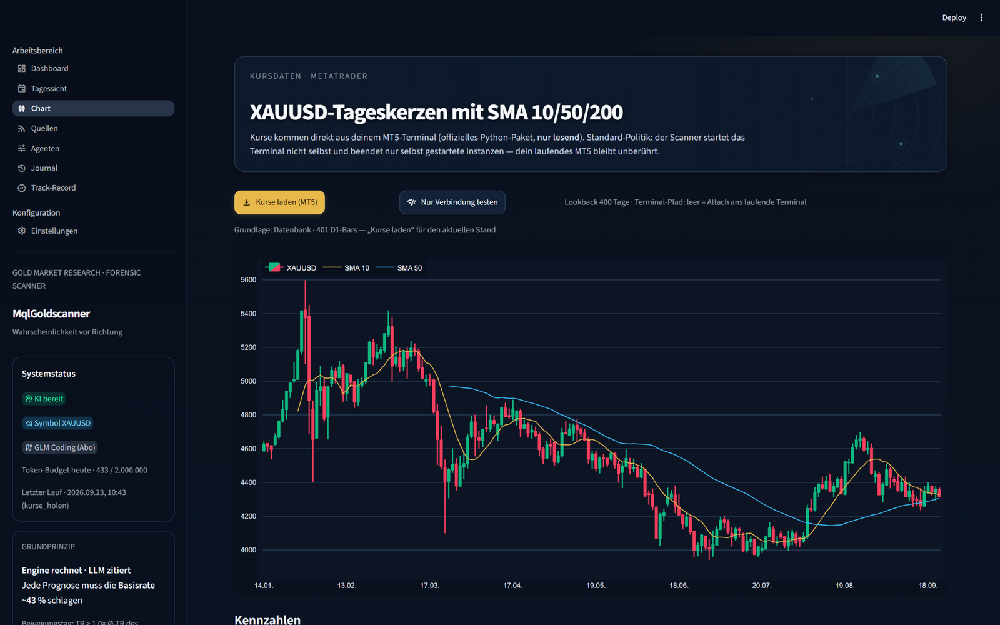

# MqlGoldscanner

**Multi-Agenten-Goldscanner (XAUUSD)** — recherchiert den Goldmarkt und erstellt für
jede Kalenderwoche eine Übersicht mit der zentralen Frage:

> **Wie hoch ist die Wahrscheinlichkeit, dass sich der Goldpreis an jedem Wochentag
> überdurchschnittlich stark bewegt — wie stark (Range-Band) — und in welche Richtung?**

Python/Streamlit im Stil des bewährten [MqlKiScanner]-Forensic-Designs (dunkles
Dashboard, Gold-Akzente). Statistik zuerst, LLM gewichtet erklärt.




## Grundprinzipien

- **Engine rechnet, LLM zitiert** — alle Kennzahlen und Prognosekern-Werte werden
  deterministisch in Python berechnet; das LLM (GLM/Z.ai) destilliert Texte und
  verschiebt Prognosen nur in einem konfigurierbaren Band (±10 pp) mit Begründung.
- **Klimatologie als Messlatte** — ein „Bewegungstag" (True Range > 1,0 × Ø-TR des
  Wochentags, 13 Wochen) tritt historisch in ~43 % der Fälle auf. Jede Prognose muss
  diese Basisrate im Brier-Skill-Score schlagen — gemessen im Track-Record.
- **Richtung ist ein eigenes Kalibrierziel** P(Close > Vortages-Close), getrennt von
  der Bewegungswahrscheinlichkeit.
- **Nur lesen, niemals stören** — MT5-Zugriff ausschließlich read-only (statisch
  getestete Whitelist); ein laufendes Terminal wird nie beendet. Ehrlicher
  User-Agent, keine Bot-Schutz-Umgehung, höfliche Abrufabstände.

## Stand (Stufe 5 von 7 — 23.09.2026)

| ✅ | Baustein |
|---|---|
| ✅ | Streamlit-App mit 8 Bereichen (Dashboard, Tagessicht, Chart, Quellen, Agenten, Journal, Track-Record, Einstellungen) |
| ✅ | MetaTrader-5-Anbindung nativ (D1/H4/H1, Whitelist, nur lesend) |
| ✅ | Plotly-Candlestick-Chart mit SMA 10/50/200 + Kennzahlen-Panel (ATR/RSI/TR Wilder) |
| ✅ | GLM-Client mit Fehler-Taxonomie (1113/429·1302/finish_reason), Lauf- und Tagesbudget |
| ✅ | **Wochenmatrix**: P je Wochentag — Klimatologie mit Shrinkage, P_stat aus dem HAR-Modell UND P_finale aus der KI-Fusion, Schwelle B, Modell-Range-Band Q10–Q90, Warnstufen, Schwellen-Tabelle |
| ✅ | **Kalender-Adapter**: ForexFactory, BLS, BEA, Fed, TreasuryDirect + regelbasierte Termine (GC FND/LTD/Opex, Feiertage, DST) — Hash-Snapshot-Archiv (point-in-time) |
| ✅ | **HAR-Prognosemodell** auf ln(TR/Close): HAR-Lags + Wochentags-Dummies, Walk-Forward-Rücktest (Brier/BSS/Log-Loss/Reliability, Platt-Skalierung), Tor-T3-Ampel im Dashboard |
| ✅ | **Event-Multiplikatoren** aus Brokerdaten: NFP ×1,24 · FOMC ×1,40 · GC-Termin ×1,10 |
| ✅ | **GVZ-Historie** (CBOE Gold Volatility Index, 4.276 Tage seit 2009) als IV-Feature |
| ✅ | **News-Adapter (S4)**: 8 RSS-Quellen (FXStreet, Google-News EN/DE, Bing, FXEmpire, Investing) mit Gold-Filter, 7-Tage-Fenster und Delta-Prinzip (SHA-Dedup — unveränderte Items kosten keine Tokens) |
| ✅ | **Community-Adapter (S4)**: TradingView-Ideas (Long/Short-Zählung + Level-Cluster), Analysten-Sentiment, Kitco-Survey (Best-Effort), Retail-Kontra-Flag ab 70 % Einseitigkeit |
| ✅ | **Destillations- + Analytiker-Agent (S4)**: glm-5.3-flash destilliert News/Community zu belegten Treibern; glm-5.3 fusioniert P_stat + Events + Destillate im konfigurierbaren ±pp-Band mit Pflichtbegründung — Band-Verstöße werden systemseitig abgewiesen und geloggt; ungültige Antworten werden nie gespeichert (JSON-Validierung, Fail-Fast nach 3 Fehlern) |
| ✅ | **Treiber-Wasserfall je Tag** im Dashboard + **Wochen-PDF** (reportlab) + Postfach für Prognoseänderungen |
| ✅ | **Quant-Feeds (S5)**: FRED ohne Key (Realzins/Inflations-/Nominalzins/Dollar/VIX), CFTC Managed-Money-Netto (Veröffentlichungsverzug sauber behandelt), GLD-Bestände in Tonnen — alles point-in-time in quant_series |
| ✅ | **Richtungsmodell (S5)**: Logit P(Close > Vortag) mit Walk-Forward-Ablation (Trend → +Makro → +Positionierung); **ehrlich: schlägt die Ø-Rate nicht** → Symbole als „nicht verifiziert" gekennzeichnet |
| ✅ | **Marktlage-Sektion**: ΔRealzins/ΔDollar 5T, COT-Netto mit Perzentil, GLD-Δ, Crowding-Flags — im Dashboard und PDF |
| ✅ | **Nachkalibrierung**: Platt sofort, Isotonic (PAVA) ab 500 Beobachtungen, versioniert in der DB |
| ✅ | **Session-/Gap-Agent**: Asia-Range bis 08:00 MEZ + Wochenend-Gap, empirische bedingte Bewegungs-P auf der Tagessicht |
| ✅ | **Tagessicht**: Event-Zeitleiste (Europe/Berlin) mit Gold-Relevanz-Klassen und Dedup über Quellen |
| ✅ | MQL5-Kalender-Exporter (`mql5/CalendarExport.mq5`) für Ist-Werte + Nasdaq-Fallback |
| ✅ | Quellen-Launch-Check: 16 verifizierte Kern-URLs mit Typ-/Signaturprüfung |
| ✅ | SQLite (versioniert, Schema v4: news_items/fusionen/meldungen), Audit-Journal mit vollem Prompt/Antwort je LLM-Schritt, Prognose-Versionen (as_of) |
| ✅ | 69 pytest-Ankertests (u. a. HAR-Parameter-Recovery, Brier/BSS-Anker, Band-Disziplin, JSON-Validierung, PDF-Smoke, Kein-Look-ahead) |

**Tor T2 bestanden:** eigene Klimatologie auf Brokerdaten (1.001 Tage Tickmill XAUUSD)
= 41,2 % Bewegungstage (Bericht: ~43 % auf Futures) bei identischer Wochentags-Struktur
(Mittwoch höchste Rate).

**Tor T3 bestanden (23.09.2026):** HAR-Modell schlägt die wochentagsbewusste Klimatologie
im Walk-Forward über 850 Testtage mit **BSS +0,161** (Brier 0,244 → 0,205). Ehrlich
dokumentiert: Platt-Skalierung bringt out-of-sample noch ≈ 0 (Kanten-Kalibrierung → S5),
und Events/IV als zusätzliche Regressoren (C/D) lagen leicht unter der schlanken B-Variante.

**S4 live (23.09.2026):** erster LLM-Lauf über 246 neue News-Items und 30 TradingView-
Ideen — die Fusion bewegte die Modellwahrscheinlichkeiten dezent und begründet
(Δmax 3,0 pp, null Band-Verstöße; Treiber: FOMC-Redeflut, Claims, GC-Opex). **Tor T4**
(LLM-Delta bringt messbaren Nutzen?) wird über die kommenden Wochen im Track-Record
gemessen — bis dahin bleibt das Band konfigurierbar (Einstellungen → GLM).

**S5 (23.09.2026) — das ehrliche Tor-Ergebnis:** Das Richtungsmodell wurde mit
sauberer Ablation auf **4.078 Testtagen (17 Jahre Broker-Historie)** geprüft und
schlägt die Ø-Aufwärtswahrscheinlichkeit (52,4 %) **nicht** (BSS −0,003 bis −0,010).
Die tägliche Richtung von Gold ist mit Trend-, Makro- und Positionierungs-Features
nicht vorhersagbar — deshalb sind die Richtungssymbole klar als „nicht verifiziert"
gekennzeichnet und es gibt keine weiteren Feed-Ausbauten fürs Richtungsmodell.
Der Nutzen der S5-Feeds liegt in der **Marktlage** (ΔRealzins, ΔDollar, COT-Perzentil,
GLD-Flüsse, Crowding-Flags), die Dashboard, PDF und dem Analytiker-Agent Kontext
gibt. Nebenbei: Auf 17 Jahren gewinnt im Bewegungs-Backtest die Event+IV-Konfiguration
(har_D, BSS +0,067) — Tor T3 bleibt bestanden.

**Roadmap** (`doc/02_stufenplan.md`): S6 Betrieb & Track-Record (Daemon,
Verifikations-Agent inkl. Tor-T4-Auswertung, URL-Scout, MT5-Export) → S7 Ausbau.

## Schnellstart

```bash
pip install -r requirements.txt          # streamlit, pandas, plotly, MetaTrader5, …
start.bat                                 # oder: streamlit run streamlit_app.py
```

Voraussetzungen: Windows mit laufendem MetaTrader-5-Terminal (Symbol `XAUUSD`) und
ein GLM-API-Key (Z.ai). Key ablegen — **niemals committen** — in
`config/secrets.local.json`:

```json
{ "glm_api_key": "dein-key" }
```

(alternativ Umgebungsvariable `GLM_API_KEY` oder `.env`; Abo-Keys = Coding-Endpunkt,
PAYG-Keys = Standard-Endpunkt — in den Einstellungen umschaltbar).

## Architektur

```
streamlit_app.py + app_pages/     dünne UI-Seiten (8 Bereiche)
src/goldscanner/
  ├─ ui_design.py                 KiScanner-Forensic-Design, Gold-Variante
  ├─ llm/client.py                GLM-Client, Fehler-Taxonomie, Budgets
  ├─ mt5/kurse.py                 MT5 read-only (nativ, Whitelist-geprüft)
  ├─ kennzahlen.py                TR/ATR/RSI/SMA — reiner Code, Ankertests
  ├─ klimatologie.py              Basisrate je Wochentag (Shrinkage), Schwelle B
  ├─ modell/                      HAR-Features/OLS/Backtest/Event-Multiplikatoren/GVZ
  ├─ adapter/                     Kalender, News-RSS, Community, Quant-Feeds (FRED/CFTC/GLD)
  ├─ agenten/                     Destillation + Analytiker-Fusion (Band-Disziplin)
  ├─ llm/                         GLM-Client + Prompt-Vorlagen (config/prompts/*.md)
  ├─ bericht/                     Wochen-PDF (reportlab)
  ├─ wochenmatrix.py + wochenlauf.py   Matrix-Bau + gesteuerte Pipeline
  ├─ quellen_check.py             Wächter: Status + Content-Type + Signatur
  ├─ db.py / lock.py / config.py  SQLite, Lauf-Lock, Einstellungen
tests/                            pytest
doc/                             Konzept, Deep-Research-Berichte, Stufenplan
```

Dokumentation: [Konzept](doc/00_konzept.md) · [Stufenplan](doc/02_stufenplan.md) ·
[Deep-Research](doc/DeepResaearch/) (drei Berichte mit live verifizierten Quellen)

## Sicherheit & Quellen

- Geheimnisse (API-Keys) liegen ausschließlich in gitignorierten Dateien
  (`config/secrets.local.json`, `.env`) — die Kaskade ist
  Umgebungsvariable > `.env` > `secrets.local.json`.
- Datenquellen sind maschinenlesbare offizielle Feeds (ForexFactory-Export, BLS/BEA,
  Federal Reserve, TreasuryDirect, CFTC, FRED, Cboe, LBMA, RSS-Feeds); auf
  gesperrte Seiten (Cloudflare/ToS) wird bewusst verzichtet.
- Konventionen aus dem Deep Research: HTTP 200 beweist nichts (Content-Type und
  Signatur werden geprüft), robots/ToS werden respektiert.

## Disclaimer

Forschungs- und Projektionswerkzeug. Keine Anlageberatung, keine Garantie für
Prognosen. Alle Wahrscheinlichkeiten werden gegen historische Baselines kalibriert
und ihr Track-Record transparent ausgewiesen (ab Stufe 6).

[MqlKiScanner]: https://github.com/tnickel  (Vorlage-Projekt, lokal D:\git\MQL\MqlKiScanner)
