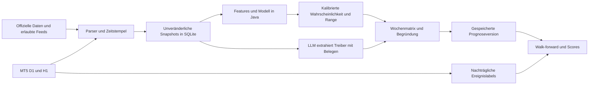

# MqlGoldscanner — Datenquellen, Prognosemethoden und Produktideen

**Recherchestand und Abrufprüfung: 23. September 2026.** Ziel: browserlose Java-21-Pipeline für tägliche XAUUSD-Bewegungswahrscheinlichkeiten und eine Wochenmatrix; kostenlos und maschinenlesbar bevorzugt. Die Ergebnisse enthalten keine aktuelle Goldpreisprognose.

Die entscheidenden Befunde:

- **Ein vollständig kostenloser, erfolgreich getesteter Gesamtkalender mit Terminen, Consensus, Actual und historisch korrekten Datenständen wurde nicht nachgewiesen.** Der funktionierende [FairEconomy-JSON-Export](https://nfs.faireconomy.media/ff_calendar_thisweek.json) hat kein `actual`-Feld. [MT5s Kalenderfunktionen](https://www.mql5.com/en/docs/calendar) sind deshalb ein sinnvoller nächster Integrationstest, aber hier nicht live ausgeführt.
- **Behördenfeeds und konkrete Dateien liefern die stärkste technische Basis:** Fed/BEA/Treasury für Termine, CFTC für Positionierung, FRED für Makroreihen und Cboe für GVZ. Aktualität, Datenrechte und Bedeutungsunterschiede sind in den Tabellen einzeln dokumentiert.
- **Mehrere bekannte Zugangswege sind veraltet oder ungeeignet:** DailyFX geschlossen; Trading Economics `guest:guest` eingestellt; die alte GLD-CSV-Adresse liefert kein CSV; verschiedene RSS-Kandidaten liefern HTML. Eine HTTP-200-Antwort reicht zur Validierung nicht aus. [IG/DailyFX](https://www.ig.com/uk/trading-strategies/dailyfx--now-get-your-trading-insights-on-ig-240906), [TE-Authentifizierung](https://docs.tradingeconomics.com/get_started/), [GLD-Historie](https://www.spdrgoldshares.com/usa/gld/).
- **Aktuelle Suche ohne API-Key ist möglich:** [Tavily Keyless](https://docs.tavily.com/documentation/keyless) lieferte im Test echtes JSON. Bing Web Search wurde eingestellt; Google Custom Search ist für neue Kunden geschlossen. [Microsoft](https://learn.microsoft.com/en-us/lifecycle/announcements/bing-search-api-retirement), [Google](https://developers.google.com/custom-search/v1/overview).
- **Die Prozentwerte sollten aus einem überprüfbaren Statistikmodell stammen.** Für genau die gewünschte 13-Wochen-TR-Definition wurde kein publizierter Kalibrierungsgewinn der recherchierten Verfahren belegt. LLMs sind für belegte Textextraktion und Erklärung sinnvoll; Modellgüte muss anhand gespeicherter Vorhersagen gemessen werden. Methodische Grundlage: [Proper Scoring Rules](https://sites.stat.washington.edu/raftery/Research/PDF/Gneiting2007jasa.pdf).

## Leseregeln und Grenzen

**GET/POST 200** bedeutet erfolgreicher direkter Abruf; das Format und der Inhalt wurden soweit angegeben zusätzlich geprüft. **WEB** bezeichnet einen lesbaren Inhalt im Recherchewerkzeug, **DOK** geprüfte Dokumentation ohne erfolgreiche authentifizierte Datenabfrage. **403/401/429/Challenge** sind beobachtete Ergebnisse dieses Clients, keine Behauptung weltweiter Nichterreichbarkeit. **PREFERRED** kennzeichnet JSON/RSS/CSV beziehungsweise vergleichbar strukturierte ICS/XLSX-Formate; es bedeutet weder garantierte Verfügbarkeit noch rechtliche Freigabe. Explizit angefragte, aber gescheiterte oder keypflichtige Wege stehen in Ausschluss-/Prüflisten und sind keine funktionierenden Standardquellen.

Gold-Relevanz und Aufwand/Nutzen sind begründete eigene Einschätzungen. „Limit unbekannt“ bedeutet, dass kein belastbares numerisches Limit verifiziert wurde; es bedeutet nicht unbegrenzt. Mit „empfohlen“ bezeichnete Polling-Abstände sind eigene Betriebsentscheidungen. Beispiele sind als reale Stichprobe oder Schema markiert. Beobachtete Aktualität eines Feeds ist kein garantierter Veröffentlichungsrhythmus. Eine erschöpfende Liste aller weltweit existierenden Quellen und langfristige Verfügbarkeit sind durch diese Recherche nicht beweisbar.

## 1. Quellenkatalog

### Block 1 – Wirtschafts- und Spezialkalender

Stand und eigene HTTP-Tests: **23.09.2026, 07:34–07:37 UTC** (09:34–09:37 Europe/Berlin). Die Tests verwenden öffentliche GET-Anfragen ohne Login/API-Key und ohne Umgehung von Schutzmaßnahmen. `HTTP 200` bedeutet hier nur technische Erreichbarkeit; Dateninhalt, Aktualität und Nutzungsrechte werden getrennt bewertet. Primärquellen und eigene Antworten wurden geprüft. Rohbelege: `research/calendar-evidence/`, insbesondere `probe1.json`, `probe2.json`, `probe3.json`, `fed-json-probe.json`, `bea-json-probe.json`. Der erste Fed-JSON-Parseversuch scheiterte am UTF-8-BOM; der erneute Test mit BOM-Behandlung war erfolgreich.

**Ergebnis:** Ein kostenloser, verifizierter Vollkalender mit freier Java-API, zuverlässigen Consensus-Werten und rückwirkenden Actual-Werten wurde nicht nachgewiesen. Der ForexFactory-Export funktioniert, enthält aber **kein Actual-Feld**. Als robuste Basis eignen sich BEA, Fed und Treasury direkt; für Actual/Consensus ist die bereits vorhandene MT5-Anbindung der aussichtsreichste zusätzliche Weg, dessen Livezugang noch getestet werden muss. `PREFERRED` kennzeichnet das technische Format und ist keine Aussage über eine offene Datenlizenz. Gold-Relevanz ist eine eigene Priorisierung, kein geschätzter Kalibrierungsgewinn.

#### Verifizierter Quellenkatalog

| Name | exakte URL | Zugangsweg (offizielle API / inoffizieller JSON-Endpunkt / RSS / HTML) | Formatbeispiel (1 Zeile) | Kosten | Update-Frequenz | Rate-Limit/Bot-Schutz | Gold-Relevanz (1–5) | Anmerkung |
|---|---|---|---|---|---|---|---:|---|
| ForexFactory/FairEconomy Wochenexport – **PREFERRED, Rechte beachten** | [https://nfs.faireconomy.media/ff_calendar_thisweek.json](https://nfs.faireconomy.media/ff_calendar_thisweek.json) | Offizielle API im Sinne eines auf der [Kalenderseite](https://www.forexfactory.com/calendar) verlinkten statischen JSON-Exports; keine dokumentierte REST-API | `{"title":"ADP Weekly Employment Change","country":"USD","date":"2026-09-22T08:15:00-04:00","impact":"Low","forecast":"","previous":"16.3K"}` | Ohne Key kostenlos abrufbar; keine offene Weiterverwendungslizenz | Rollender Wochenexport; genaue Frequenz nicht unabhängig als SLA bestätigt | Kein numerisches Limit verifiziert; defensiv höchstens stündlich, für Wochenplanung 1–2× täglich | 5 | **GET 200, application/json; 80 Events.** Exakt sechs Felder, kein `actual`, kein Event-ID-Feld. `country` enthält Währungscodes. Kein vollständiges historisches Überraschungsdatenset. [Nutzungsbedingungen](https://www.forexfactory.com/notices) beschränken Kopieren/Weiterverbreitung der Kalenderdaten. |
| ForexFactory Webkalender | [https://www.forexfactory.com/calendar](https://www.forexfactory.com/calendar) | HTML | `Event / Actual / Forecast / Previous` | Öffentlich ohne Login | Laufende Veröffentlichungen, keine verifizierte SLA | **GET 200**, HTML; wechselnder Schutz möglich; ToS beachten | 5 | Menschliche Gegenprüfung und Export-Einstieg. JSON/CSV/XML/ICS sind auf dieser Seite verlinkt; die anderen Formate wurden nicht zusätzlich heruntergeladen. HTML-Abruf ist kein Freibrief für Datenbankkopien. |
| BEA Release Calendar – **PREFERRED** | [https://apps.bea.gov/API/signup/release_dates.json](https://apps.bea.gov/API/signup/release_dates.json) | Offizielle API / statisches JSON; ausdrücklich [offiziell verlinkt](https://www.bea.gov/news/schedule/icalendar) | `"Personal Income and Outlays":{"release_dates":["2026-09-30T12:30:00+00:00",...]}` | Kostenlos, kein Key | Bei Terminänderungen; im Test `file_last_updated=2026-07-13T08:00:42.402013` | **GET 200, application/json**; kein numerisches Limit gefunden; 1× täglich genügt als Startwert | 5 | PCE, GDP, Handelsbilanz; Termine ohne Consensus/Actual. JSON enthält auch zurückliegende Daten und Duplikate: deduplizieren. Die September-PCE-Terminprobe stimmt mit [HTML](https://www.bea.gov/news/schedule) und ICS überein. |
| BEA iCalendar – **PREFERRED** | [https://www.bea.gov/news/schedule/ics/online-calendar-subscription.ics](https://www.bea.gov/news/schedule/ics/online-calendar-subscription.ics) | Offizieller Kalenderexport / ICS | `SUMMARY:Personal Income and Outlays\, August 2026; DTSTART:20260930T123000Z` | Kostenlos, kein Key | Bei Terminänderungen | **GET 200, text/plain**, Inhalt valides VCALENDAR; 1× täglich empfohlen | 5 | Nützlicher als JSON, wenn Berichtsmonat, UID und einzelne Veröffentlichung benötigt werden. Nicht nur Content-Type, auch Dateisignatur prüfen. [Dokumentation](https://www.bea.gov/news/schedule/icalendar). |
| Federal Reserve Terminfeed – **PREFERRED** | [https://www.federalreserve.gov/json/calendar.json](https://www.federalreserve.gov/json/calendar.json) | Inoffizieller JSON-Endpunkt auf offizieller Domain, von der eigenen Website verwendet | `{"title":"Speech - Governor Michael S. Barr","month":"2026-09","days":"23","time":"10:05 a.m.","type":"Speeches",...}` | Kostenlos, kein Key | Bei Kalenderänderungen; keine SLA | **GET 200, application/json**, UTF-8-BOM; kein veröffentlichtes Limit gefunden; 1–2× täglich empfohlen | 5 | Eigene [calendar.js](https://www.federalreserve.gov/js/cms/calendar.js) ruft genau diesen Pfad auf. Top-Level `events`, `announcement`; 2.586 Event-Elemente inkl. Historie und leerem Schlussobjekt. Mehrtägige Events und leere Zeiten berücksichtigen. Board-Kalender, keine behauptete Vollabdeckung aller regionalen Fed-Präsidenten. |
| Fed FOMC Sitzungen/Minutes | [https://www.federalreserve.gov/monetarypolicy/fomccalendars.htm](https://www.federalreserve.gov/monetarypolicy/fomccalendars.htm) | HTML | `October 27–28, 2026; December 8–9*` | Kostenlos | Jahresplanung; Updates bei Beschlüssen/Minutes | **GET 200, text/html**; 1× täglich bzw. wöchentlich plus an Sitzungstagen empfohlen | 5 | Autoritative Sitzungstermine, SEP-Kennzeichnung und spätere Statements/Minutes. Minutes regulärer Sitzungen normalerweise drei Wochen nach Entscheidung. Kein Forecast-Feld. |
| Fed Reden – **PREFERRED** | [https://www.federalreserve.gov/feeds/speeches.xml](https://www.federalreserve.gov/feeds/speeches.xml) | RSS | `<rss version="2.0"><channel><title>FRB: Speeches</title>…` | Kostenlos | Nach veröffentlichten Reden | **GET 200, text/xml**; kein Limit gefunden; stündlich empfohlen | 5 | Texte nach Veröffentlichung; **kein Ersatz für den Zukunftskalender**. Für Reden-Zeitplanung zusätzlich [Fed Calendar](https://www.federalreserve.gov/newsevents/calendar.htm), ebenfalls GET 200. |
| EZB Ratssitzungen | [https://www.ecb.europa.eu/press/calendars/mgcgc/html/index.en.html](https://www.ecb.europa.eu/press/calendars/mgcgc/html/index.en.html) | HTML | `29/10/2026 – monetary policy meeting, Day 2, followed by press conference` | Kostenlos | Jahresplanung/Änderungen | **GET 200, text/html**; kein Limit gefunden; wöchentlich plus tägliche Änderungsprüfung empfohlen | 4 | Geldpolitische und sonstige Sitzungen unterscheiden. EUR/USD und globale Zinsübertragung sind die begründete Gold-Relevanz; kein belegter fester Range-Effekt. |
| EZB Wochenagenda | [https://www.ecb.europa.eu/press/calendars/weekly/html/index.en.html](https://www.ecb.europa.eu/press/calendars/weekly/html/index.en.html) | HTML | `Datum / Zeit / Redner / Veranstaltung` | Kostenlos | Wochenagenda, Änderungen möglich | **GET 200, text/html**; 1× täglich empfohlen | 4 | Ergänzt Reden und Auftritte. Konkrete Veranstaltung und Zeitzone aus der Agenda übernehmen; nicht jede öffentliche Rede ist geldpolitisch relevant. |
| TreasuryDirect angekündigte Auktionen – **PREFERRED** | [https://www.treasurydirect.gov/TA_WS/securities/announced?format=json](https://www.treasurydirect.gov/TA_WS/securities/announced?format=json) | Offizielle API; [Entwickler-Einstieg](https://www.treasurydirect.gov/legal-information/developers/) | `{"securityTerm":"5-Year","auctionDate":"2026-09-23T00:00:00","closingTimeCompetitive":"01:00 PM",...}` | Kostenlos, kein Key im Test | Mit Ankündigungen/Auktionsdaten | **GET 200, application/json**; kein numerisches Limit gefunden; 1–2× täglich empfohlen | 4 | 2y/5y/10y/30y filtern. Enthält auch vergangene Datensätze: `auctionDate` begrenzen. Bei Reopenings `originalSecurityTerm` berücksichtigen. `floatingRate=Yes` ausschließen, wenn eine feste 2y Note gemeint ist. Mitternacht in `auctionDate` ist **keine Auktionsuhrzeit**. |
| CFTC COT Release Schedule | [https://www.cftc.gov/MarketReports/CommitmentsofTraders/ReleaseSchedule/index.htm](https://www.cftc.gov/MarketReports/CommitmentsofTraders/ReleaseSchedule/index.htm) | HTML | `Report date / publication date` | Kostenlos | Jahresplan, Feiertags-/Sonderänderungen | **GET 200, text/html**; 1× wöchentlich und bei Störungen empfohlen | 3 | Normalerweise Freitag 15:30 **America/New_York**, Positionen vom vorangehenden Dienstag. Feiertage/Shutdowns verschieben Termine. [CFTC Erläuterung](https://www.cftc.gov/MarketReports/CommitmentsofTraders/AbouttheCOTReports/cot_about.html). |
| Census Economic Indicators – **PREFERRED** | [https://www.census.gov/economic-indicators/indicator.xml](https://www.census.gov/economic-indicators/indicator.xml) | RSS | `<rss version="2.0"><channel>…<item><title>…` | Kostenlos, kein Key | Bei Releases | **GET 200, application/xml**; stündlich oder nach angekündigtem Release empfohlen | 4 | Release-Nachträge für Retail Sales, Durable Goods, Housing usw.; ergänzt [HTML-Übersicht](https://www.census.gov/economic-indicators/), GET 200. RSS ist kein vollständiger Zukunftskalender. |
| Investing Wirtschaftskalender – technisch erreichbar, automatischer Abruf ausgeschlossen | [https://www.investing.com/economic-calendar/](https://www.investing.com/economic-calendar/) | HTML | `Time / Currency / Event / Actual / Forecast / Previous` | Öffentlich ohne Login | Laufend, keine SLA geprüft | **GET 200, text/html**; ToS §10(c) verbietet automatisierte Extraktion | 5 | Keine Empfehlung für Jsoup-Produktivbetrieb. [Terms, §10(c)](https://cdn.investing.com/about-us/terms_and_conditions.pdf) verbieten Bots/Scraping ausdrücklich; [robots.txt](https://www.investing.com/robots.txt) ersetzt diese Bedingungen nicht. Kein offiziell nutzbarer kostenloser Kalender-API-Zugang verifiziert. |
| IG Kalender, Nachfolger des DailyFX-Einstiegs | [https://www.ig.com/uk/economic-calendar?source=dailyfx](https://www.ig.com/uk/economic-calendar?source=dailyfx) | HTML | `Economic and trading calendar` | Öffentlich | Kalender laufend; keine SLA geprüft | **GET 200, text/html** nach DailyFX-Redirect | 4 | Kalenderseite verifiziert, maschinenlesbare Event-API nicht. Nicht als zusätzliche unabhängige DailyFX-Quelle zählen. [IG bestätigt Schließung am 04.09.2024](https://www.ig.com/uk/trading-strategies/dailyfx--now-get-your-trading-insights-on-ig-240906). |
| FXStreet Kalender | [https://www.fxstreet.com/economic-calendar](https://www.fxstreet.com/economic-calendar) | HTML mit dynamischem Kalenderwidget | `
` | Öffentliche Webseite; API-Lizenz nicht verifiziert | Laufend laut Seite | **GET 200, text/html**; kein verifizierter freier API-Key-Zugang | 5 | Das Vorhandensein von `calendar-api-version` ist **kein** Beleg einer frei verwendbaren API. Für Java ohne Browser derzeit nur zweitrangiger Integrationskandidat. |

Die Zahlen für Abruffrequenzen in der Spalte Rate-Limit sind **eigene konservative Betriebsempfehlungen**, sofern sie als „empfohlen“ bezeichnet werden. Sie sind keine vom Anbieter garantierten Freigaben.

#### Angefragte, aber nicht als frei funktionierende Datenquelle bestätigte Wege

Diese Ausschlussliste ist getrennt, damit HTTP-Fehler und lediglich dokumentierte APIs nicht als erfolgreich getestete Datenlieferanten erscheinen.

| Name | exakte URL | Zugangsweg (offizielle API / inoffizieller JSON-Endpunkt / RSS / HTML) | Formatbeispiel (1 Zeile) | Kosten | Update-Frequenz | Rate-Limit/Bot-Schutz | Gold-Relevanz (1–5) | Anmerkung |
|---|---|---|---|---|---|---|---:|---|
| Myfxbook Kalender | [https://www.myfxbook.com/forex-economic-calendar](https://www.myfxbook.com/forex-economic-calendar) | HTML; UI bietet CSV/XML-Export | `Previous / Consensus / Actual` | Öffentliche Webseite | Laufend, keine SLA | **Direkter GET 403**, Cloudflare „Just a moment“; Recherche-Webcrawler konnte die Kalenderansicht lesen | 5 | Kein aktuell nutzbarer JSON-Endpunkt nachgewiesen. In der [offiziellen API](https://www.myfxbook.com/api) ist keine Economic-Calendar-Methode dokumentiert. API-Login ist deshalb kein belegter Lösungsweg. |
| Myfxbook legacy CSV-Exportkandidat | [https://www.myfxbook.com/calendar_statement.csv?filter=0-1-2-3_USD&start=2026-09-21%2000:00:00.0&end=2026-09-27%2023:59:59.0&calPeriod=10&tabType=0](https://www.myfxbook.com/calendar_statement.csv?filter=0-1-2-3_USD&start=2026-09-21%2000:00:00.0&end=2026-09-27%2023:59:59.0&calPeriod=10&tabType=0) | Inoffizieller Exportkandidat / CSV erwartet | Tatsächlich: HTML-Challenge, **keine CSV-Daten** | Nicht belegt | Nicht belegt | **GET 403, text/html** | 5 | `filter`, `start`, `end`, `calPeriod`, `tabType` wurden so getestet. Aktuelle Semantik, erforderliche Cookies und Verwendung dieser Parameter durch heutiges JavaScript **nicht verifiziert**. Nicht als funktionierende API übernehmen. |
| FairEconomy nextweek | [https://nfs.faireconomy.media/ff_calendar_nextweek.json](https://nfs.faireconomy.media/ff_calendar_nextweek.json) | Vermutete statische JSON-Variante | `404 Not Found` | — | — | **GET 404, text/html** | 5 | Am Testtag nicht vorhanden. Daraus folgt keine Aussage über andere künftig eingeführte Pfade. |
| FairEconomy expired-Varianten | [https://nfs.faireconomy.media/ff_calendar_thisweek_expired.json](https://nfs.faireconomy.media/ff_calendar_thisweek_expired.json); [https://nfs.faireconomy.media/ff_calendar_expired.json](https://nfs.faireconomy.media/ff_calendar_expired.json) | Vermutete statische JSON-Varianten | `404 Not Found` | — | — | **Beide GET 404, text/html** | 4 | Keine historische Actual-Quelle. „Expired“ nicht als vorhandene API-Funktion behandeln. |
| Trading Economics Kalender – dokumentierte kostenpflichtige Alternative | [https://docs.tradingeconomics.com/economic_calendar/](https://docs.tradingeconomics.com/economic_calendar/); [getesteter Guest-Aufruf](https://api.tradingeconomics.com/calendar/country/united%20states?c=guest:guest&f=json) | Offizielle API, JSON/CSV; Key notwendig | Dokumentiert: `CalendarId,Date,Country,Event,Actual,Previous,Forecast,Importance` | Kein funktionierender Free-Guest-Zugang; Kalenderpreis/Entitlement vor Kauf bestätigen | Anbieter: laufende Aktualisierung | **Guest GET 410**: Gastkonto eingestellt. Dokumentiert: max. 2 Requests/s, 1.000 Kalenderzeilen/Call | 5 | Nutzbarer bezahlter Zugang **nicht live getestet**. [Limits](https://docs.tradingeconomics.com/get_started/rate-limits/), [Authentifizierung](https://docs.tradingeconomics.com/get_started/), [Preise/Trialbedingungen](https://tradingeconomics.com/api/pricing.aspx). Keine alten kostenlosen `guest:guest`-Beispiele kopieren. |
| Finnhub Economic Calendar – kostenpflichtiger Kandidat | [https://finnhub.io/docs/api/economic-calendar](https://finnhub.io/docs/api/economic-calendar); [getesteter API-Aufruf ohne Key](https://finnhub.io/api/v1/calendar/economic?from=2026-09-21&to=2026-09-27) | Offizielle API, JSON, `from`, `to`, API-Key | Dokumentiert: `{"economicCalendar":[{"actual":8.4,"country":"AU","estimate":6.9,"event":"…","impact":"low","prev":1,"time":"…","unit":"AUD"}]}` | **Economic-1: 50 USD/Monat, quartalsweise 150 USD; Personal Use** | Aktuelle/bevorstehende Events laut Dokumentation; SLA nicht verifiziert | API ohne Key **401 JSON**; Economic-1 laut [Preisseite](https://finnhub.io/pricing-economic-data-api): 150 Calls/min | 5 | Preis und Limit aus ausgeliefertem HTML plus öffentlichem JS der Preisseite geprüft. Docs markieren „Premium Access Required“. Preisseite nennt 10 Jahre Kalender, API-Docs verweisen historische Events/Surprises auf Enterprise: historisches Entitlement **widersprüchlich, vor Kauf klären**. |
| FMP Kalender – zusätzliche API-Alternative | [https://financialmodelingprep.com/stable/economic-calendar?from=2026-09-21&to=2026-09-27](https://financialmodelingprep.com/stable/economic-calendar?from=2026-09-21&to=2026-09-27) | Offizielle API, JSON | Im Test: `{"Error Message":"Invalid API KEY…"}` | [Basic](https://site.financialmodelingprep.com/developer/docs/pricing): 250 Calls/Tag kostenlos; **Kalenderfreischaltung darin nicht nachgewiesen** | SLA nicht geprüft | **GET 401** ohne Key | 5 | [Dokumentation](https://site.financialmodelingprep.com/developer/docs/stable/economics-calendar) bestätigt Stable-Endpunkt. Nicht aus einem allgemeinen Free-Tier ableiten, dass dieser Kalender kostenlos ist. |
| BLS iCalendar – **PREFERRED, hier blockiert** | [https://www.bls.gov/schedule/news_release/bls.ics](https://www.bls.gov/schedule/news_release/bls.ics) | Offizieller Kalenderexport / ICS | Erwartet `BEGIN:VCALENDAR`; tatsächlich Access-Denied-HTML | Kostenlos laut offiziellem Angebot | Laut [BLS](https://www.bls.gov/help/hlpiCAL.htm) bedarfsweise, geplanter Updatezeitpunkt Freitag ca. 15:30 ET | **GET 403**; auch [Jahres-HTML](https://www.bls.gov/schedule/2026/home.htm) hier 403, Webcrawler liest Seite | 5 | CPI/NFP/PPI/JOLTS. Nicht „tot“: offizielles Angebot aktuell dokumentiert, aber auf diesem Java-ähnlichen HTTP-Abrufweg nicht erfolgreich. |
| ISM Veröffentlichungstermine | [https://www.ismworld.org/supply-management-news-and-reports/reports/rob-report-calendar/](https://www.ismworld.org/supply-management-news-and-reports/reports/rob-report-calendar/) | HTML | `October 2026: Manufacturing 1; Services 5` | Öffentliche Kalenderseite | Monatliche Releases, Terminplan | Webcrawler liest aktuelle 2026-Tabelle; direkter GET landet nach SSO-Redirect auf **404**; anderer ISM-Einstieg auf CAPTCHA | 5 | Manufacturing/Services typischerweise erster/dritter Geschäftstag 10:00 Eastern; konkrete offizielle Ausnahmen haben Vorrang. Nicht als zuverlässige browserlose Verbindung bestätigt. |
| MetaTrader 5 Economic Calendar – **PREFERRED Integrationskandidat** | [https://www.mql5.com/en/docs/calendar](https://www.mql5.com/en/docs/calendar) | Offizielle API **innerhalb MQL5/MT5**, kein HTTP-Dienst | `CalendarValueHistory(values, from, to, NULL, "USD")` | Kein separater API-Preis in Referenz genannt; Terminal erforderlich | Daten laut Hersteller bei Veröffentlichung | Dokumentation **GET 200**; Terminalfunktion hier **nicht ausgeführt** | 5 | `CalendarValueLast` liefert Änderungen via `change_id`; Actual/Forecast/Previous über Kalenderstrukturen. Kleiner MQL5-Exporter → JSON/CSV → Java ist eine eigene Architektur-Empfehlung. **Trade-Server-Zeit**, nicht UTC oder lokale PC-Zeit; Offsethistorie beachten. |
| CME Gold Futures – First Notice/Last Trade | [https://www.cmegroup.com/markets/metals/precious/gold.calendar.html](https://www.cmegroup.com/markets/metals/precious/gold.calendar.html) | HTML / dynamischer Kalender | Im Test: `{"message":"This IP address is blocked due to suspected web scraping activity…"}` | Öffentliche Anzeige; automatisierte Lizenz nicht nachgewiesen | Bei Kontraktlistung/Änderungen | **GET 403 JSON**, ausdrückliches Scraping-Verbot in Antwort | 4 | Kein kostenloser Java-Abruf empfohlen. Kein Schutz umgangen. Manuelle Ansicht als Referenz; für Übernahme in den Scanner explizit lizenzierter Datenweg. |
| CME Gold Opex / QuikStrike | [https://www.cmegroup.com/tools-information/quikstrike/options-calendar.html](https://www.cmegroup.com/tools-information/quikstrike/options-calendar.html) | HTML mit eingebettetem QuikStrike-Tool | `Options Expiration Calendar / contract month / expiration month` | Öffentliche Ansicht; API-Rechte nicht nachgewiesen | Kontraktkalender | Seite im Recherche-Webcrawler lesbar; tatsächlicher Datenabruf ohne Browser **nicht verifiziert** | 4 | CME beschreibt Download/Ansicht über ein Jahr einschließlich Weekly-Expiries. Nicht mit First Notice Day gleichsetzen; keine freien internen JSON-Pfade behauptet. |

#### Konkrete Folgerungen für den Kalender-Agenten

**Myfxbook:** Die belastbare Antwort ist „kein funktionierender öffentlicher Kalender-JSON-Endpunkt in diesem Test bestätigt“. CSV/XML-Schaltflächen sind sichtbar; der direkte Exportkandidat scheitert am Schutz. Die offizielle API dient Konto-/Sentimentdaten und dokumentiert keinen Wirtschaftskalender. Behauptete AJAX-Endpunkte oder Parameterlisten aus alten Beispielen sind ohne erfolgreichen Datentest keine produktive Grundlage. Die [Terms](https://www.myfxbook.com/terms) und eine robots-Datei gaben hier keine belastbare spezifische Scraping-Freigabe; robots lieferte selbst 403.

**Actual vs. Forecast:** Der FairEconomy-Test weist für alle 80 Events dieselben sechs Felder nach, einschließlich bereits vergangener Termine; `actual` fehlt vollständig. Für Pre-Event-Planung kann das Format helfen, für Surprise-Features nicht. Eigene Snapshots allein ergänzen keinen nie gelieferten Actual-Wert. Ein später revidierter `previous`-Wert ist außerdem nicht automatisch der ursprünglich veröffentlichte Actual. Für Backtests müssen `release_time`, `ingested_at`, `actual_first`, `actual_latest`, `forecast_asof`, `previous_asof` und Revisionen getrennt gespeichert werden; das ist eine eigene Datenmodell-Empfehlung.

**Spezialtermine:** FOMC-Entscheidung, Pressekonferenz, Minutes, SEP und Reden als getrennte Eventtypen modellieren. Treasury-Felder `securityType`, `originalSecurityTerm`, `floatingRate`, Datum und tatsächliche Schlusszeit auswerten. Der Treasury-Test zeigt auch 2-Jahres-FRN-Datensätze, sodass bloßes Suchen nach „2-Year“ fachlich falsch wäre. COT ist ein zeitverzögerter Positionierungsinput; der Veröffentlichungszeitpunkt darf nicht als Zeitpunkt der gemessenen Positionen verwendet werden. [Fed](https://www.federalreserve.gov/monetarypolicy/fomccalendars.htm), [Treasury API](https://www.treasurydirect.gov/TA_WS/securities/announced?format=json), [CFTC](https://www.cftc.gov/MarketReports/CommitmentsofTraders/AbouttheCOTReports/cot_about.html).

**First Notice Day ist kein Optionsverfall.** NYMEX/COMEX Rule 706.C setzt den ersten Notice Day auf den letzten Geschäftstag vor dem Liefermonat. Standard-Goldoptionen nach Rule 115101.E verfallen vier Geschäftstage vor Ende des Vormonats, mit Anpassung bei Freitag/Tag vor Börsenfeiertag sowie Sonderregeln bei nachträglich veränderten Feiertagen. Weekly-Optionen separat führen. Für konkrete 2026-Kontrakte wurde kein automatischer vollständiger Termindownload verifiziert; keine vermeintlich exakten Daten aus einem alten Produktkalender übernehmen. [Lieferregeln, Chapter 7](https://www.cmegroup.com/rulebook/NYMEX/1/7.pdf), [Gold Options, Chapter 115](https://www.cmegroup.com/rulebook/COMEX/1a/115.pdf).

**Zeitzonen:** US-Termine mit der tatsächlichen Quellzeitzone `America/New_York` speichern, nach UTC normalisieren und erst in der Oberfläche nach `Europe/Berlin` umrechnen. Ein fester Sechs-Stunden-Abstand ist wegen unterschiedlicher Sommerzeitwechsel falsch. FairEconomy enthält einen Offset; BEA liefert UTC. Fed liefert textuelle Zeiten. MT5 verwendet ausdrücklich Broker-Serverzeit. Unbekannte Zeit, „all day“ und verschobene Releases separat kennzeichnen, statt eine Uhrzeit zu erfinden. [BLS](https://www.bls.gov/schedule/2026/home.htm), [BEA ICS](https://www.bea.gov/news/schedule/ics/online-calendar-subscription.ics), [MT5](https://www.mql5.com/en/docs/calendar).

### Block 2 — Gold-News und Analyse

Direkte öffentliche GET-Anfragen ohne Login, Cookies oder Schutzumgehung; XML wurde geparst, HTML auf tatsächliche Inhalte geprüft. Die Tests sind Momentaufnahmen, keine Zusage dauerhafter Verfügbarkeit. Protokolle: `news_probes.json`, `news_probes_extra.json`, `news_probes_final.json`; Antworten unter `probes/`. **200 allein genügt nicht:** mehrere vermeintliche Feeds lieferten eine Suchseite, Startseite oder leeres JSON. Alle RSS-Beispiele unten sind verkürzte **Schemas**, keine erfundenen Datensätze. `title/link/pubDate` bedeutet die tatsächlich vorgefundenen XML-Felder. **PREFERRED bezeichnet die technische Eignung des Formats, keine Lizenzfreigabe.**

Die angegebene Frequenz beschreibt die beobachteten Veröffentlichungen oder die vom Anbieter benannte Serie; sie ist kein SLA. Relevanz 1–5 ist meine Einschätzung für XAUUSD-Volatilitätsforschung. „Frei“ meint ohne Zahlung/Anmeldung in der Stichprobe; Weiterverarbeitung, Weitergabe und Übermittlung an externe LLMs sind getrennt zu klären. Exakte kommerzielle Preise wurden bei diesen Nachrichtenquellen nicht verifiziert.

Die Tabelle enthält acht technisch nutzbare Bestandsanbieter einschließlich des allgemeinen MarketWatch-RSS sowie **15 zusätzliche Anbieter** (N01–N15). Reuters und DailyFX stehen anschließend im Fehlerregister, weil der gewünschte Weg nicht funktionierte. Alle URLs in der Tabelle wurden am Testtag abgerufen; die Links führen zugleich zu den Primärbelegen.

| Name | exakte URL | Zugangsweg (offizielle API / inoffizieller JSON-Endpunkt / RSS / HTML) | Formatbeispiel (1 Zeile) | Kosten | Update-Frequenz | Rate-Limit/Bot-Schutz | Gold-Relevanz (1–5) | Anmerkung |
|---|---|---|---|---|---|---|---|---|
| Kitco – Bestand | [https://www.kitco.com/news](https://www.kitco.com/news) | HTML | Schema: Titel, Zeit, Link, Teaser | Frei gelesen | Mehrfach täglich; Beiträge 22.09. | GET 200; numerisches Limit nicht dokumentiert | 5 | Hoher Goldanteil, daneben Silber/Mining/Krypto. RSS `/rss/news` **404**; kein funktionierender Nachrichten-RSS bestätigt. 1 Ebene bis Artikel. |
| FXStreet – Bestand | [https://www.fxstreet.com/commodities/gold](https://www.fxstreet.com/commodities/gold); [https://www.fxstreet.com/rss/news](https://www.fxstreet.com/rss/news); [https://www.fxstreet.com/rss/analysis](https://www.fxstreet.com/rss/analysis) | **PREFERRED RSS**, ergänzend HTML | RSS: `item/title,link,pubDate,description` | Öffentliche Feeds frei; API/Syndikation separat | Intraday News; Analyse täglich; 23.09. | Alle 200; beide Feeds 30 Items; Limit unbekannt | 5 | Alte Gold-URL redirectet hierher. Gold/XAU im Titel: News 2/30, Analysis 12/30; Momentaufnahme, kein Langzeitanteil. Goldseite gezielt, Feeds gemischt. Freier Artikel geprüft; andere Beiträge können Premium sein. |
| MarketWatch – Bestand, eingeschränkt | [https://feeds.content.dowjones.io/public/rss/mw_topstories](https://feeds.content.dowjones.io/public/rss/mw_topstories); [https://www.marketwatch.com/investing/future/gc00](https://www.marketwatch.com/investing/future/gc00) | **PREFERRED RSS**; HTML problematisch | RSS: `item/title,link,pubDate,description` | Feed frei; verlinkte Artikel teils Abonnement | Allgemeiner Feed täglich; 23.09. | RSS 200/10 Items; GC00 direkt **401**, Webabruf lesbar | 2 | RSS ist **kein Goldfeed**, Stichprobe 0/10 Goldtitel. GC00 ist Continuous Gold Future, kein XAUUSD-Spot. Für Java nicht auf die HTML-Seite bauen. |
| CNBC – Bestand | [https://www.cnbc.com/gold/](https://www.cnbc.com/gold/); [https://www.cnbc.com/id/10000664/device/rss/rss.html](https://www.cnbc.com/id/10000664/device/rss/rss.html) | HTML + **PREFERRED RSS** | RSS: `item/title,link,pubDate,description` | Frei/Premium gemischt | Feed täglich, 23.09.; Goldseite letzte sichtbare Daten 16.09. | Beide GET 200; Feed 30 Items; Limit unbekannt | 3 | RSS ist allgemeiner Finanzfeed, **nicht goldspezifisch**. 1/30 Titel mit gold/XAU (ein Wortfilter kann Goldman mitzählen); Qualität durch Asset-Klassifikation sichern. Goldseite am Stichtag nicht tagesfrisch. |
| World Gold Council – Bestand | [https://www.gold.org/goldhub/research/library](https://www.gold.org/goldhub/research/library) | HTML, teils Downloads | Schema: Reporttitel, Berichtsperiode, Link | Research offen; Datenrechte separat | Monatskommentare, Quartalsberichte, Sonderstudien | GET 200; **Scraping gemäß ToS beschränkt** | 5 | Hoher Goldanteil; Q2-2026-Berichte und Outlook sichtbar. RSS nicht bestätigt. Keine automatische Volltextpipeline ohne passende Erlaubnis; [Bedingungen](https://www.gold.org/terms-and-conditions). |
| BullionVault – Bestand | [https://www.bullionvault.com/gold-news](https://www.bullionvault.com/gold-news) | HTML | Schema: Überschrift, Datum, Artikel-Link | Frei gelesen | Preisberichte regelmäßig, Meinungsstücke mehrmals/Woche | GET 200; Limit unbekannt | 5 | Gold-/Silberfokus und Investor Index; Liste enthält Beiträge bis 20.09. Eine technische 200-Antwort ist kein eigener Aktualitätsbeleg jeder Unterrubrik. RSS `/gold-news/rss.xml` redirectet auf `/gold-news/node/feed`, dort **400**. |
| FXEmpire – Bestand | [https://www.fxempire.com/forecasts/gold](https://www.fxempire.com/forecasts/gold) | HTML, eingebetteter Seitenzustand | Schema: Titel, Autor, Datum, Link, Premium-Marker | Frei und PrimeX/Premium gemischt | Tägliche Goldprognosen; frische Seitendaten 23.09. | GET 200; kein öffentlicher API-Vertrag verifiziert | 5 | Goldrubrik gezielt, 1 Ebene zum Artikel, Pagination per `?page=2`. **Kein funktionierender RSS bestätigt**. Eingebettetes JSON ist keine offizielle API. |
| Invezz – Bestand | [https://invezz.com/news/commodities/](https://invezz.com/news/commodities/); [https://invezz.com/feed/](https://invezz.com/feed/) | **PREFERRED RSS**, HTML | RSS: `item/title,link,pubDate,description,content:encoded` | Frei gelesen | Mehrfach täglich gesamt; aktueller Goldbeitrag 23.09. | GET 200; RSS 15 Items; Limit unbekannt | 3 | Feed gemischt, 1/15 Titel Gold. `/news/commodities/gold/` **404**; `/commodities/gold/` **410**. Feed liefert aktuellere Hinweise als die getestete Kategorie-Seite. |
| N01 Goldreporter – DE | [https://www.goldreporter.de/](https://www.goldreporter.de/); [https://www.goldreporter.de/feed/](https://www.goldreporter.de/feed/) | **PREFERRED RSS** | RSS: `item/title,link,pubDate,description` | Frei gelesen; einzelne Angebote separat | Mehrere Beiträge/Tag; 23.09. | 200; RSS 20 Items; Limit unbekannt | 5 | 16/20 Titel Gold; täglicher Marktbericht, Zentralbankreserven, physische Flüsse. Gute deutschsprachige Ergänzung. RSS umfasst Teaser, nicht automatisch Volltextrechte. |
| N02 GOLD.DE – DE | [https://www.gold.de/wissen-news/](https://www.gold.de/wissen-news/); [https://www.gold.de/rss.php](https://www.gold.de/rss.php) | **PREFERRED RSS** | RSS: `item/title,link,pubDate,description` | Frei; Feed offiziell angeboten | Mehrmals/Woche; Feed 22.09., Analyse 21.09. | 200; RSS 10 Items; Limit unbekannt | 4 | 7/10 Titel Gold, darunter Produktmeldungen: Münzneuheiten herausfiltern. [Offizielle Feed- und API-Seite](https://www.gold.de/chartgenerator/). `/rss/` ist **404**. |
| N03 Goldseiten – DE | [https://www.goldseiten.de/](https://www.goldseiten.de/); [https://www.goldseiten.de/rss/newsfeed.xml](https://www.goldseiten.de/rss/newsfeed.xml) | **PREFERRED RSS** | RSS: `item/title,link,pubDate,description,dc:creator` | Frei gelesen | Mehrfach täglich; 23.09. | 200; RSS 30 Items; Limit unbekannt | 4 | 11/30 Goldtitel; Edelmetalle, Makro, Mining-Pressemitteilungen. Syndizierte Texte deduplizieren und Pressemitteilungen niedriger gewichten. `/rss.php` **404**. |
| N04 GoldSeek – EN | [https://goldseek.com/](https://goldseek.com/); [https://goldseek.com/rss.xml](https://goldseek.com/rss.xml) | **PREFERRED RSS** | RSS: `item/title,link,pubDate,description,dc:creator` | Frei gelesen | Mehrere Beiträge/Tag; 22.09. | 200; RSS 10 Items; Limit unbekannt | 4 | 4/10 Titel Gold, übrige Makro/Silber/Politik/Mining. Meinungsquelle mit Autoren- und Syndikationsfiltern; keine unabhängige Bestätigung allein durch Zweitveröffentlichung. |
| N05 Gold-Eagle – EN | [https://www.gold-eagle.com/](https://www.gold-eagle.com/); [https://www.gold-eagle.com/rss.xml](https://www.gold-eagle.com/rss.xml) | **PREFERRED RSS** | RSS: `item/title,link,pubDate,description` | Frei gelesen | Täglich; 23.09. | 200; RSS 30 Items; robots: `Crawl-delay: 10` | 4 | 21/30 Titel Gold; Gold-Forecasts und Chartautoren. Feed `/feed` wäre falsch: 200 einer Suchseite. Häufig wiederveröffentlichte Kommentare; Autorencluster berücksichtigen. |
| N06 investingLive, früher ForexLive – EN | [https://investinglive.com/](https://investinglive.com/); [https://investinglive.com/feed/](https://investinglive.com/feed/) | **PREFERRED RSS** | RSS: `item/title,pubDate,link,description` | Frei gelesen | Intraday; 23.09. | 200; RSS 25 Items; robots-Abruf 403 | 4 | ForexLive-Seiten/Feed redirecten auf neue Domain. Gemischter Makrofeed, 1/25 Goldtitel; besonders für USD-/Zinsnachrichten. Kurzes Feedfenster verlangt häufigeres Polling, wenn Vollständigkeit nötig ist. |
| N07 ActionForex Gold – EN | [https://www.actionforex.com/tag/gold/](https://www.actionforex.com/tag/gold/); [https://www.actionforex.com/tag/gold/feed/](https://www.actionforex.com/tag/gold/feed/) | **PREFERRED RSS** | RSS: `item/title,link,pubDate,description,dc:creator` | Frei gelesen | Mehrfach/Woche bis täglich; 23.09. | 200; RSS 20 Items; Limit unbekannt | 5 | Gold-Tag liefert deutlich besseren Filter als Gesamtfeed; 18/20 Titel Gold, 20 Items seit 07.09. Technische und fundamentale Analysen; Beitragsautoren/Originalquelle erhalten. |
| N08 ING THINK – EN | [https://think.ing.com/market/commodities/](https://think.ing.com/market/commodities/); [https://think.ing.com/rss](https://think.ing.com/rss) | **PREFERRED RSS**, HTML | RSS: `item/title,link,description,dc:date` | Öffentlich gelesen | Makro/Commodities täglich; Gold unregelmäßig | 200; RSS 10 Items; Limit unbekannt | 4 | **Datum `dc:date`, nicht `pubDate`**; 23.09. Gemischter Feed (0/10 Goldtitel in Probe), dennoch USD/Rates/Commodities-Kontext. Originales Bankresearch hilft gegen Echoeffekte. `/commodities/` **404**. |
| N09 OANDA MarketPulse – EN | [https://www.marketpulse.com/markets/commodities/](https://www.marketpulse.com/markets/commodities/); [https://www.marketpulse.com/feed/](https://www.marketpulse.com/feed/) | **PREFERRED RSS**, HTML | RSS: `item/title,link,pubDate,content:encoded` | Frei gelesen | Unregelmäßig; Feed 22.09.; Rohstoffrubrik 11.09. | 200; nur 3 RSS-Items; Limit unbekannt | 3 | Chartkommentare nützlich, aber RSS-Probe hatte **0 Goldtitel** und begrenzte Historie. Goldfrische separat prüfen; kein verlässlicher täglicher Goldfeed bewiesen. |
| N10 Heraeus Precious Appraisal – EN/DE | [https://www.heraeus-precious-metals.com/en/precious-metal-prices-reports/weekly-market-report/](https://www.heraeus-precious-metals.com/en/precious-metal-prices-reports/weekly-market-report/) | HTML; Report/PDF-Format | Schema: Ausgabennummer, Datum, Wochenkommentar | Teaser frei; Newsletteranmeldung optional | Wöchentlich; Nr. 34 vom 21.09. | 200; Limit unbekannt | 4 | Edelmetall-Dealerresearch, Gold neben Silber/PGM. **Aktueller Teaser bestätigt; direkter aktueller PDF-Download nicht bestätigt.** RSS nicht gefunden. HTML-Landingpage eignet sich als Änderungsindikator. |
| N11 Sprott Insights – EN | [https://sprott.com/insights/](https://sprott.com/insights/) | HTML | Schema: Reporttitel, Autor, Datum, Metall-Tag | Frei gelesen | Precious Metals Report monatlich; 08.09. und 06.08. | 200; Limit unbekannt | 4 | Datenreiche Gold-/Silber- und Makroanalysen; dazu andere Rohstoffe. Fondsanbieter-Perspektive, keine neutrale Gesamtmarktstichprobe. RSS nicht bestätigt. |
| N12 pro aurum – DE | [https://www.proaurum.de/newsroom/](https://www.proaurum.de/newsroom/) | HTML | Schema: Titel, Datum, Kategorie, Link | Frei gelesen | News regelmäßig; Goldreport monatlich | 200; Feed-Versuch 404; Limit unbekannt | 3 | Neueste sichtbare News 16.09.; Goldreport 08/26 vom 28.08. Dealer- und Vertriebsthemen dominieren teilweise. Keine tägliche Gold-Analyse behaupten; RSS nicht bestätigt. |
| N13 Saxo Commodities – EN | [https://www.home.saxo/insights/news-and-research/commodities](https://www.home.saxo/insights/news-and-research/commodities) | HTML | Schema: Titel, Autor, Datum, Artikeltext | Frei gelesen | Mehrfach/Woche; Gold- und COT-Beiträge 21.09. | Übersicht und Goldartikel 200; Limit unbekannt | 5 | Originales Bank-/Strategenresearch und COT-Zusammenfassungen. Aktueller Goldartikel ohne Login gelesen; 1 Ebene tief. RSS nicht bestätigt. |
| N14 IG Commodities – EN | [https://www.ig.com/uk/tag/commodities](https://www.ig.com/uk/tag/commodities) | HTML | Schema: Titel, Zeitpunkt, Analyse-Link | Frei gelesen | Werktäglich gemischt; Goldchartanalyse 21.09. | Übersicht/Artikel 200; Limit unbekannt | 4 | Praktischer DailyFX-Ersatz, mit charttechnischen Levels. Kein neuer DailyFX-Feed. RSS nicht bestätigt; Goldfilter auf Artikel-Ebene. |
| N15 Perth Mint Investor News – EN | [https://www.perthmint.com/news/investor/](https://www.perthmint.com/news/investor/) | HTML | Schema: Datum, Titel, Kategorie, Artikel-Link | Frei gelesen | Markt-/Absatzreport monatlich; 04.09. für August | 200; Limit unbekannt | 4 | Primärquelle eines Produzenten für eigene Bullion-Verkäufe plus Marktkommentar; weitere Investor-News 15.09. Gold/Silber von Produktwerbung trennen; RSS nicht bestätigt. |

#### Nicht als funktionierende Quellen aufnehmen

- **DailyFX:** [https://www.dailyfx.com/gold-price](https://www.dailyfx.com/gold-price) liefert nach Redirect HTTP 200 auf [IGs Gold-Produktseite](https://www.ig.com/uk/commodities/markets-commodities/gold?source=dailyfx). Das ist kein aktueller DailyFX-Researchdienst. IG bestätigt die [Schließung zum 04.09.2024](https://www.ig.com/uk/trading-strategies/dailyfx--now-get-your-trading-insights-on-ig-240906). Alte DailyFX-News-/Kalender-/Chartfeeds nicht weiterempfehlen.
- **Reuters:** [https://www.reuters.com/markets/commodities/](https://www.reuters.com/markets/commodities/) direkt **401**; Webabruf scheiterte ebenfalls. Goldanteil und aktuelle Frequenz in diesem Test nicht belastbar messbar. [https://feeds.reuters.com/reuters/commoditiesNews](https://feeds.reuters.com/reuters/commoditiesNews) DNS-Auflösung gescheitert. Kein aktueller kostenloser öffentlicher Gold-RSS bestätigt. 401 allein beweist weder zwingenden Login noch Paywall.
- **Mining.com:** [Goldrubrik](https://www.mining.com/commodity/gold/) und [RSS-Kandidat](https://www.mining.com/commodity/gold/feed/) beide **403**. Kein funktionierender Feed bewiesen; nicht als PREFERRED auflisten.
- **SchiffGold:** [News](https://www.schiffgold.com/news) und [Feedkandidat](https://www.schiffgold.com/feed/) **403 / „Just a moment…“**. **Money Metals:** [News](https://www.moneymetals.com/news) und [Feedkandidat](https://www.moneymetals.com/news/feed) **403**. **Forex.com:** [Goldanalyse](https://www.forex.com/en-us/news-and-analysis/gold/) **403 / Challenge**. **MKS PAMP:** [Insights](https://www.mkspamp.com/insights) **403**. Das ist nur der Abrufstatus dieses Clients, keine Behauptung globaler Nichterreichbarkeit.
- **Weitere Schein-Feeds:** [FXEmpire `/feed`](https://www.fxempire.com/feed) redirectet auf HTML-Startseite; [FXEmpire API-RSS-Kandidat](https://www.fxempire.com/api/v1/en/articles/rss) liefert HTTP 200, `application/json`, aber nur **`[]`**. [BullionVault RSS](https://www.bullionvault.com/gold-news/rss.xml) endet bei 400. [Gold-Eagle `/feed`](https://www.gold-eagle.com/feed) liefert HTML-Suche. Diese Tests zeigen nicht, dass ein anderer Feed unmöglich ist; nur die genannten URLs sind ungeeignet.
- **Degussa Altpipeline:** [alter Marktreportpfad](https://www.degussa-goldhandel.de/infothek/marktreport/) redirectet auf eine Unternehmensseite, keine aktuelle Reportliste. Nicht als aktuelle Researchquelle zählen.

### Block 3 — Chartanalyse und Community

Fremde Chartmeinungen sind Feature-Kandidaten, keine validierten Wahrscheinlichkeiten. Für Konsens-Levels mindestens Instrument, Kursanbieter, Zeithorizont, Veröffentlichung/Änderung und Autor speichern; Futures- und XAUUSD-Levels wegen Basis und Rollwechseln nicht direkt zusammenwerfen. Das ist eine methodische Empfehlung aus der unterschiedlichen Instrumentdefinition, keine vom Anbieter behauptete Prognoseleistung.

| Name | exakte URL | Zugangsweg (offizielle API / inoffizieller JSON-Endpunkt / RSS / HTML) | Formatbeispiel (1 Zeile) | Kosten | Update-Frequenz | Rate-Limit/Bot-Schutz | Gold-Relevanz (1–5) | Anmerkung |
|---|---|---|---|---|---|---|---|---|
| TradingView XAUUSD Ideas | [https://www.tradingview.com/symbols/XAUUSD/ideas/](https://www.tradingview.com/symbols/XAUUSD/ideas/) | HTML | Schema: Autor, Long/Short, Text, Chartbild, Update-Zeit | Lesen in Probe ohne Login | Viele Nutzerbeiträge; September 2026 sichtbar | 200, aber **Automatisierung laut Bedingungen untersagt** | 4 | Bereits auf Liste umfangreiche Texte; 1 Ebene zur Einzelidee. Keine öffentliche Ideas-API/RSS verifiziert. Für manuelle Referenz, **nicht in automatische LLM-Pipeline**; [Policy](https://www.tradingview.com/policies/), [Automationsverbot](https://www.tradingview.com/support/solutions/43000674726-why-is-my-account-banned-due-to-suspicious-activity/). |
| FXStreet Gold Technical + Poll | [https://www.fxstreet.com/commodities/gold](https://www.fxstreet.com/commodities/gold); [https://www.fxstreet.com/rss/analysis](https://www.fxstreet.com/rss/analysis) | **PREFERRED RSS** + HTML | RSS: `title/link/pubDate/description`; HTML: Levels, Horizont | Goldübersicht und geprüfter Artikel frei | Tagesanalyse; Poll zuletzt 18.09. 15:00 GMT | 200; 30 RSS-Items; Rechte beachten | 5 | Goldseite enthält technische Absätze und Forecast Poll; RSS liefert Artikel-URLs. [Freier Artikel vom 23.09.](https://www.fxstreet.com/analysis/gold-price-forecast-bull-bear-tug-of-war-extends-for-xau-usd-ahead-of-trump-xi-meet-202609230341) mit Text/Levels ohne Login. Allgemeiner Pfad `/analysis/gold-price-forecast` ist **404**. |
| Investing Gold Futures Technical | [https://www.investing.com/commodities/gold-technical](https://www.investing.com/commodities/gold-technical) | HTML | Schema: `RSI,MACD,MA5…MA200,S1…R3,as-of` | Seite ohne Login lesbar | Intraday; Zeitstempel 23.09. 07:21 GMT | 200; Datenverwendung gemäß ToS erlaubnispflichtig | 4 | Tabellen bereits auf erster Seite; andere Timeframes interaktiv, nicht als stabile API bestätigt. **Gold Futures**, nicht Spot-XAUUSD; Indikatorabstimmung ist keine Analystenumfrage. [Bedingungen](https://www.investing.com/about-us/terms-and-conditions). |
| FXEmpire Gold Forecasts | [https://www.fxempire.com/forecasts/gold](https://www.fxempire.com/forecasts/gold) | HTML | Schema: Autor, Datum, Text-Levels, Chart | Frei/Premium gemischt | Täglich | 200; Rate-Limit unbekannt | 5 | Eine Ebene zur Analyse; mehrere Autoren und Methoden. Premium-Marker beachten; keine RSS- oder JSON-API-Freigabe bestätigt. |
| ActionForex Gold-Autoren | [https://www.actionforex.com/tag/gold/feed/](https://www.actionforex.com/tag/gold/feed/); [https://www.actionforex.com/tag/gold/](https://www.actionforex.com/tag/gold/) | **PREFERRED RSS** + HTML | RSS: `title/link/pubDate/dc:creator` | Frei gelesen | Mehrfach/Woche bis täglich | 200; 20 aktuelle Items; Limit unbekannt | 5 | Gute technische Kandidatenliste für Java. Artikel 1 Ebene tief; Beiträge anderer Researchhäuser mit Originalautoren deduplizieren. |
| IG Technical Analysis | [https://www.ig.com/uk/tag/commodities](https://www.ig.com/uk/tag/commodities); [Goldanalyse 21.09.](https://www.ig.com/uk/news-and-trade-ideas/ftse-100-recovers-while-gbp-usd--gold-price-hover-above-support-260921) | HTML | Schema: Datum, Instrument, Support/Resistance, Chart | Frei in Probe | Werktäglich gemischte Analysen | Liste/Artikel 200; Limit unbekannt | 4 | Eine Ebene zum Text, Gold als Abschnitt eines Mehrmarktbeitrags; aktuelle DailyFX-Nachfolgeoption. Automations-/LLM-Rechte nicht bestätigt. |
| Saxo Bankresearch | [https://www.home.saxo/insights/news-and-research/commodities](https://www.home.saxo/insights/news-and-research/commodities); [Goldresearch 21.09.](https://www.home.saxo/content/articles/commodities/gold-breaks-with-real-yields-as-fiscal-concerns-reshape-investor-demand-21092026) | HTML | Schema: Autor, Datum, Treiber, Chart, Szenario | Frei in Probe | Mehrfach/Woche | Liste/Artikel 200; Limit unbekannt | 4 | Eher Makro-/Positionierungsmeinung als rein technische Levels. Bank-Originaltexte ergänzen syndizierte Kurzmeldungen; keine Verteilung von Tageswahrscheinlichkeiten dokumentiert. |
| Forex Factory Gold Forum | [https://www.forexfactory.com/thread/1100220-gold?goto=lastpost](https://www.forexfactory.com/thread/1100220-gold?goto=lastpost) | HTML | Schema: Post-ID, Autor, Zeit, Text, Bild-Link | Lesen ohne Login in Probe | Laufende Posts; letzte Seite am Testtag 4870 | 200; Weiterleitung auf letzten Post; Limit unbekannt | 2 | **Nicht Seite 1 als aktuell auswerten**; Last-Post-Link nutzen. Hoher Rausch-/Eigenwerbeanteil; Charts teils Bilder, externe Attachments nicht vollständig geprüft. Zunächst nur kuratierte Autoren manuell, Rechte unbestätigt. |
| Gold-Eagle Forecast-Autoren | [https://www.gold-eagle.com/rss.xml](https://www.gold-eagle.com/rss.xml); [https://www.gold-eagle.com/](https://www.gold-eagle.com/) | **PREFERRED RSS** + HTML | RSS: `title/link/pubDate/description` | Frei gelesen | Täglich / einzelne Wochenprognosen | 200; robots Crawl-delay 10 Sekunden | 4 | Feed für Forecast-Titel filtern, eine Ebene zum Artikel; zyklische/technische Methoden und Meinungsartikel nicht vermischen. Rechte zur automatischen LLM-Verarbeitung nicht bestätigt. |

DailyFX Gold Technical ist aus denselben Gründen wie DailyFX Gold News auszusortieren; der frühere Anbieter ist geschlossen. Keine separate funktionierende DailyFX-Chart-API verifiziert.

### Block 4 – Sentiment, Positionierung und Marktdaten

Recherche und direkte HTTP-Stichproben: **23.09.2026**. Die Tests liefen mit einem gewöhnlichen HTTP-Client ohne Login, Browser, CAPTCHA-Lösung oder Schutzumgehung. **GET 200 + Inhalt** bedeutet, dass Inhalt und Datenstruktur geprüft wurden, nicht nur der Statuscode. **WEB** bedeutet, dass die Primärquelle über das Recherchewerkzeug lesbar war; das ist kein Nachweis für einen Java-Abruf. **DOK** bedeutet Produkt/Datenformat offiziell dokumentiert, aber kein authentifizierter Datenabruf getestet. **PREFERRED** bewertet hier ausschließlich das maschinenlesbare Format; die Nutzungsrechte sind separat ausgewiesen. Beispieldaten sind echte Testauszüge, außer ausdrücklich mit „Schema“ gekennzeichnet. Fehlende Limits werden nicht als unbegrenzt behandelt.

Die beste erste Datenbasis ist CFTC-COT plus FRED-Realyields; GVZ und GLD liefern zusätzlich technisch einfache Daten, haben aber eigene Nutzungsbedingungen. WGC, CME und BlackRock sind **keine pauschal frei nutzbaren Scraping-Quellen**. Ein öffentlich herunterladbares Dokument ist noch keine Erlaubnis für automatisches Sammeln oder Nutzung durch LLMs.

#### Quellenkatalog

| Name | exakte URL | Zugangsweg (offizielle API / inoffizieller JSON-Endpunkt / RSS / HTML) | Formatbeispiel (1 Zeile) | Kosten | Update-Frequenz | Rate-Limit/Bot-Schutz | Gold-Relevanz (1–5) | Anmerkung |
|---|---|---|---|---|---|---|---|---|
| CFTC Disaggregated Futures Only – Gold | [JSON Gold aktuell](https://publicreporting.cftc.gov/resource/72hh-3qpy.json?cftc_contract_market_code=088691&%24order=report_date_as_yyyy_mm_dd%20DESC&%24limit=1) | **PREFERRED – offizielle API**, SODA2 JSON | `{"report_date_as_yyyy_mm_dd":"2026-09-15T00:00:00.000","open_interest_all":"409899"}` (Auszug) | Kostenlos; Test ohne Token | Wöchentlich; üblicherweise Freitag 15:30 America/New_York, Stand Dienstag | GET 200 + JSON; numerisches Limit nicht publiziert/verifiziert; anonym nach IP gedrosselt, X-App-Token empfohlen | 5 | Dataset `72hh-3qpy`, `cftc_contract_market_code=088691`; kein Micro Gold (`088695`). Managed Money long `142394`, short `9278` im Test. [Offizielle API-Hilfe](https://publicreporting.cftc.gov/stories/s/COT-Help/p2fg-u73y/). |
| CFTC Gold – gefilterte lange Historie | [CSV-Historie](https://publicreporting.cftc.gov/resource/72hh-3qpy.csv?cftc_contract_market_code=088691&%24select=report_date_as_yyyy_mm_dd,open_interest_all,m_money_positions_long_all,m_money_positions_short_all&%24order=report_date_as_yyyy_mm_dd%20ASC&%24limit=2000) | **PREFERRED – offizielle API**, CSV | `"2006-06-13T00:00:00.000","288981","99739","29859"` | Kostenlos | Wöchentlich, mögliche Revisionen | GET 200 + CSV; 54.896 Textzeichen; paginieren, keinen unbegrenzten Vollabruf annehmen | 5 | Test bestätigt Gold-Historie ab 13.06.2006. `$select` verkleinert die Antwort. Berichtstypen nicht mischen; ältere Legacy-Kategorien sind anders definiert. |
| CFTC Veröffentlichungskalender | [Release Schedule](https://www.cftc.gov/MarketReports/CommitmentsofTraders/ReleaseSchedule/index.htm) | HTML | Schema: `Jahr / Monat / Veröffentlichungstag` | Kostenlos | Jährlich, Anpassungen bei Feiertagen | GET 200 + HTML | 4 | Kalender statt pauschal „jeden Freitag“ verwenden. [CFTC FAQ](https://www.cftc.gov/es/node/128971) bestätigt 15:30 ET und Dienstag-Stichtag. |
| SPDR GLD tägliche Bestände und Historie | [Aktueller offizieller XLSX-Download](https://api.spdrgoldshares.com/api/v1/historical-archive?product=gld&exchange=NYSE&lang=en) | **PREFERRED – offizieller Download-Endpunkt**, XLSX; von der [GLD-Seite](https://www.spdrgoldshares.com/usa/gld/) verlinkt | `22-Sep-2026; Closing Price=400.07; Tonnes of Gold=1055.98` (aus XLSX, gerundet) | Kostenloser Abruf; Rechte eingeschränkt | Geschäftstäglich; Test letzter Stand 22.09.2026 | GET 200, 540.103 Bytes; XLSX-ZIP und Tabelleninhalt geprüft; kein öffentliches numerisches Limit | 5 | Blatt `US GLD Historical Archive`, seit 18.11.2004. Datum, Closing Price, Gold oz/share, NAV/share, Volumen, Gesamtunzen, Tonnen, NAV. **Kein Spot-OHLC**. [Bedingungen](https://www.spdrgoldshares.com/terms-and-conditions/) beachten. |
| iShares IAU aktuelle Goldmenge | [IAU Fondsseite](https://www.ishares.com/us/products/239561/ishares-gold-trust-fund) | HTML plus eingebettete strukturierte Daten | `Sep 22, 2026; Tonnes in Trust=463.85; Ounces in Trust=14,913,044.75` | Öffentlich lesbar; automatisierte Nutzung zustimmungspflichtig | Geschäftstäglich, `as of` je Feld | GET 200; Felder im Server-HTML vorhanden; kein Browser erforderlich; aber ToS-Verbot automatischer Agents | 4 | Jsoup-Selektoren `data-id="keyFundFacts-ounces-data"`, entsprechende Tonnenfelder. Nicht aus Bar-Listen dieselbe Stichtagssemantik unterstellen. [BlackRock-Bedingungen](https://www.blackrock.com/corporate/compliance/terms-and-conditions). |
| iShares IAU NAV/Anteile-Historie | [Offiziell verlinkter Download](https://www.blackrock.com/varnish-api/blk-one01-product-data/product-data/api/v1/get-fund-document?appType=PRODUCT_PAGE&appSubType=ISHARES&targetSite=us-ishares&locale=en_US&portfolioId=239561&component=fundDownload&userType=individual) | **PREFERRED – offizieller Download-Endpunkt**, Excel-2003-SpreadsheetML/XML, **kein XLSX** | `Sep 22, 2026;81.382874;--;793250000` | Öffentlich; Rechte wie IAU-Seite | Geschäftstäglich | GET 200, 1.992.932 Bytes; Roh-XML wegen unescaped `&` im Disclaimer nicht streng XML-konform | 4 | Blatt `Historical`: As Of, NAV per Share, Ex-Dividends, Shares Outstanding; 5.452 Zeilen inkl. Header, bis 21.01.2005. **Enthält keine Tonnenhistorie**. Toleranten Parser verwenden. |
| Cboe Gold ETF Volatility Index GVZ | [GVZ_History.csv](https://cdn.cboe.com/api/global/us_indices/daily_prices/GVZ_History.csv) | **PREFERRED – offizieller CSV-Download** | `09/22/2026,23.590000` | Kostenloser Download; begrenzte Nutzungsrechte | Tägliche Schlusswerte | GET 200 + valides CSV, 89.745 Bytes; Rate unbekannt | 5 | Header `DATE,GVZ`, Testhistorie 18.09.2009–22.09.2026. Auf [Cboes Historienseite](https://www.cboe.com/tradable-products/vix/vix-historical-data) verlinkt. 30-Tage-Volatilität aus GLD-Optionen; kein direkter XAUUSD-Tagesrange-Forecast. [Cboe Terms](https://www.cboe.com/terms). |
| FRED DFII10 – 10J-TIPS-Realyield | [CSV DFII10](https://fred.stlouisfed.org/graph/fredgraph.csv?id=DFII10) | **PREFERRED – offizieller CSV-Download**; [REST-API](https://fred.stlouisfed.org/docs/api/fred/) mit Key alternativ | `2026-09-21,2.62` | Kostenlos | Tägliche Beobachtungen, Veröffentlichung nach US-Schluss; Datenlatenz beachten | GET 200 + CSV; kein Key für getesteten Export; Download-Limit nicht dokumentiert | 5 | Prozent p.a., **keine** erwartete Goldrendite. Historie im Test ab 02.01.2003. [Serienbeschreibung](https://fred.stlouisfed.org/series/DFII10). |
| FRED DTWEXBGS – breiter Dollarindex | [CSV DTWEXBGS](https://fred.stlouisfed.org/graph/fredgraph.csv?id=DTWEXBGS) | **PREFERRED – offizieller CSV-Download** | `2026-09-18,119.5133` | Kostenlos | Tägliche Beobachtungen, **wöchentliche** H.10-Veröffentlichung | GET 200 + CSV; Rate unbekannt | 4 | Breiter handelsgewichteter USD-Index, Januar 2006=100. **Nicht ICE DXY**. Am Prüftag nur bis Freitag 18.09.; [FRED](https://fred.stlouisfed.org/series/DTWEXBGS) nennt Update 21.09. und nächste Veröffentlichung 28.09. |
| FRED SP500 – Aktienrisiko-Kontext | [CSV SP500](https://fred.stlouisfed.org/graph/fredgraph.csv?id=SP500) | **PREFERRED – offizieller CSV-Download** | `2026-09-22,7764.64` | Kostenloser Abruf; S&P-Rechte eingeschränkt | US-Schlusswert täglich | GET 200 + CSV | 3 | Nur rollierende **10 Jahre** täglicher Historie bei FRED; Preisindex ohne Dividenden. [Seriennotiz](https://fred.stlouisfed.org/series/SP500) verbietet Reproduktion ohne S&P-Erlaubnis. |
| ICE DXY – Originalindex | [ICE Currency Indices](https://www.ice.com/fixed-income-data-services/index-solutions/currency-indices) | HTML; lizenzierte Datenprodukte | `ICE U.S. Dollar Index / DXY` (Produktidentifikation) | Datenpreis nutzungsabhängig; kein freier API-Tarif verifiziert | Marktdatenprodukt; gewählter Service maßgeblich | GET 200 der Produktseite; **kein** anonymer Datenfeed nachgewiesen | 4 | Sechs feste Währungsgewichte, EUR 57,6%; [ICE-Erklärung](https://www.ice.com/insights/indexation-and-etfs/managing-us-dollar-risk-in-uncertain_times). Für No-Budget-Prototyp FRED-Breitindex klar anders benennen oder vorhandenes lizenziertes Brokerinstrument prüfen. |
| WGC globale ETF-Bestände/Flows | [Gold ETFs Holdings and Flows](https://www.gold.org/goldhub/data/gold-etfs-holdings-and-flows) | HTML; verlinkte XLSX-Dateien (**Format PREFERRED, Download gesperrt**) | Schema: `Fonds/Region, Holdings(t), Flow(USD), Zeitraum` | Registrierung als kostenlos beschrieben; Nutzung beschränkt | Website wöchentlich und monatlich; Excel monatlich | HTML GET 200; aktueller XLSX-Link GET **403** | 5 | Wöchentliche Aktualisierung montags außer Monatsupdate; Monatsdaten meist binnen einer Woche. Über 100 physisch besicherte Fonds. Kein öffentlich dokumentierter stabiler JSON-Feed verifiziert; [Terms](https://www.gold.org/terms-and-conditions) nennen Scraping-Verbot. |
| WGC offizielle Goldreserven | [Gold Reserves by Country](https://www.gold.org/goldhub/data/gold-reserves-by-country) | HTML; XLSX-Links, interaktives Dashboard teils Login | `Data as of 30 June, 2026; update 3 September, 2026` (echte Seitenangabe) | Kostenloses Konto angeboten; Nutzung beschränkt | Monatliche Dateien, Quartalsdaten; meist mehrere Monate Datenrückstand | HTML GET 200; drei getestete XLSX-Downloads **403** | 4 | Reihen seit 2000 quartalsweise; monatliche Änderungen seit 2002. Aktualisierte Datei bedeutet nicht neue zeitgleiche Käufe. WGC ergänzt/korrigiert Meldedaten; Länder können später melden. |
| WGC Gold Demand Trends / Zentralbanknachfrage | [Q2 2026 Central Banks](https://www.gold.org/goldhub/research/gold-demand-trends/gold-demand-trends-q2-2026/central-banks) | HTML und PDF; keine freie API verifiziert | `Q2'26; Central Banks and Other Institutions;288.9 tonnes` | Öffentlich; WGC-Bedingungen | Quartalsweise, Revisionen | WEB lesbar; separater direkter GET hier nicht durchgeführt | 4 | Q1-2026-Schätzung im Q2-Bericht von 244t auf 57t revidiert. Deshalb Erstveröffentlichung als Vintage sichern. Meldungen, Schätzungen ungemeldeter Käufe und Absichtsumfragen nicht gleichsetzen. |
| CME FedWatch API | [FedWatch API](https://www.cmegroup.com/market-data/market-data-api/fedwatch-api.html) | **PREFERRED – offizielle REST-API**, JSON; Konto/Vertrag | Schema: `FOMC meeting, target-rate range, probability, as-of` – Datenpayload ungetestet | Offiziell EOD ab **25 USD/Monat**; [Gebührentabelle](https://www.cmegroup.com/market-data/files/interface-connection-agreement-apis.pdf) | EOD oder Intraday alle 60 Sekunden, Historie laut Anbieter bis 2015 | DOK/WEB; kein Key-Abruf; öffentliche CME-Webseiten lokal 403 | 5 | Maschineller Weg existiert. 0–1.000 hits/Monat/API-ID laut v11; **hit=Antwort-Element**, nicht Request. Vertrag/weitere Nutzungsrechte und Entitlements prüfen; kein Gratisfeed nachgewiesen. |
| CME Daily Bulletin – GC OI, Settlements, Laufzeiten | [Daily Bulletin](https://www.cmegroup.com/market-data/daily-bulletin.html); [Section 62 PDF](https://www.cmegroup.com/daily_bulletin/current/Section62_Metals_Futures_Products.pdf) | HTML + PDF | `Tue, Sep 22, 2026; PRELIMINARY; SETT. PRICE; OPEN INTEREST` (Dokumentauszug) | Öffentliches Lesen; automatisierte Pipeline ohne Erlaubnis ausgeschlossen | Vorläufig ca. 00:00 CT, final ca. 10:00 CT am nächsten Geschäftstag | WEB: aktuelles PDF mit 9 Seiten lesbar; direkter GET der Einstiegsseite **403** mit Scraping-Sperrtext | 5 | OI und Settlement je Laufzeit erlauben Kurven-/Rollanalyse. Historischer Vollbestand über DataMine. [CME Data Terms](https://www.cmegroup.com/trading/market-data-explanation-disclaimer.html) untersagen Scraping/Software-/AI-Nutzung ohne Zustimmung. |
| Barchart OnDemand Futures | [getQuote-Dokumentation](https://www.barchart.com/ondemand/api/getQuote); [API-Katalog](https://www.barchart.com/ondemand/api) | **PREFERRED – offizielle API**, JSON/CSV mit Key | Schema: `symbol,tradeTimestamp,lastPrice,volume` | Kommerzielles Angebot; aktueller verbindlicher Preis hier nicht verifiziert | Je Vertrag Echtzeit, verzögert oder EOD | WEB-Doku lesbar; direkter Doku-GET 202 ohne Inhalt, kein Key-Datentest | 4 | `getQuote` unterstützt Root-Symbol plus `^F` für Laufzeiten, `getHistory` historische Reihen. Kein belastbares dauerhaft kostenloses Angebot nachgewiesen; alte Gratis-Key-Anleitungen nicht übernehmen. |
| LBMA Gold Price | [LBMA Precious Metal Prices](https://www.lbma.org.uk/prices-and-data/lbma-precious-metal-prices) | HTML, Mitgliederportal für historische Tabellen | Schema: `Datum, Gold AM/USD, Gold PM/USD` | Öffentliche aktuelle Anzeige; History-Zugang nach Prüfung; kommerzielle Benchmark-Nutzung lizenzpflichtig | AM/PM-Auktionen, öffentliche jüngste Preise am folgenden Arbeitstag | GET 200 der HTML-Seite; kein offener historischer CSV/API-Feed verifiziert | 4 | Seit Woche ab 24.11.2025 historische Tabellen ins Portal verschoben. Auch Nichtmitglieder können für nichtkommerzielle/educational Nutzung Zugang beantragen. [Umstellung](https://www.lbma.org.uk/articles/lbma-benchmark-prices-data-tables-are-moving), [Lizenzhinweis](https://www.lbma.org.uk/prices-and-data/lbma-gold-price). |
| Shanghai Gold Benchmark AM/PM | [Getesteter JSON-Abruf](https://www.sge.com.cn/graph/DayilyJzj?start=2026-09-01&end=2026-09-22); [Quellseite](https://www.sge.com.cn/sjzx/jzj) | **PREFERRED – inoffizieller JSON-Endpunkt** der offiziellen SGE-Website | `{"zp":[[1790006400000,936.61]],"wp":[[1790006400000,932.0]]}` (je letzter Punkt) | Abruf ohne Zahlung; Nutzungsrecht **nicht frei** | Börsentäglich AM/PM | GET 200 + JSON; 2.537 AM-Punkte; auch POST geprüft; Rate unbekannt | 4 | 19.04.2016–22.09.2026. CNY/g. Epoch ist lokales Mitternacht Asia/Shanghai; UTC-Datum liegt einen Tag früher! `start/end` wurde bei GET und POST ignoriert, deshalb lokal filtern. [SGE-Datennutzungsregeln](https://www.sge.com.cn/sjzx/rzxxs) verlangen Genehmigung. |
| Shanghai tägliche Handelsdaten / IV-Kurve | [Daily Report](https://en.sge.com.cn/h5_data_DailyReport); [Options-IV-Kurve](https://www.sge.com.cn/sjzx/goldoptionsqxcx); [Forwardkurve](https://www.sge.com.cn/sjzx/qxcx) | HTML + JavaScript | Schema: `Kontrakt, OHLC, Volume, OI` bzw. `Tenor, IV` | Öffentliche Seiten; Datennutzung genehmigungspflichtig | Börsentäglich; exakte IV-Publikationszeit nicht verifiziert | Daily/IV-HTML GET 200, aber Tabellen leer; zusätzlicher Daily-Load-GET lieferte 200 mit leerem Body | 3 | **Keine** funktionierende browserlose Datenpipeline für diese Tabellen bestätigt. Shanghai-IV ist nicht XAUUSD-IV. Als Ausbauidee führen, nicht als betriebsfertigen Feed. |
| US Mint Bullion Sales | [Bullion Sales](https://www.usmint.gov/about/production-sales-figures/bullion-sales) | HTML, angebotener Download | Schema: `Programm, Jahr/Monat, Stückzahl/Unzen` | Kostenlos; Weiterveröffentlichung mit Mint als Quelle laut Seite erlaubt | **Monatlich** laut aktueller Seite | WEB lesbar; direkter GET **403**, Browserprüfung | 2 | Kein täglich verlässlicher Demand-Signalfeed. Verkäufe an Authorized Purchasers sind nicht identisch mit Endkundennachfrage. Aktualisierte Datenstände können spätere Revisionen fehlen lassen. |
| Google Trends „gold price“ | [Offizielle API Alpha](https://developers.google.com/search/apis/trends) | **PREFERRED – offizielle API**, Zugang nach Bewerbung; nicht allgemein offen | Schema: `search term, region, interval, interest` – Payload ungetestet | Kein allgemein verfügbarer Tarif/Quota verifiziert | Täglich/wöchentlich/monatlich/jährlich aggregierbar | DOK und Landingpage GET 200; keine Alpha-Zugangsdaten | 2 | Rolling 5 Jahre, konsistente Skalierung über Abfragen. Nicht behaupten „Google hat keine Trends-API“. Für sofortigen No-Key-Betrieb ungeeignet; UI-Scraper sind kein belastbarer Ersatz. |
| IMF International Liquidity / IRFCL | [International Liquidity](https://data.imf.org/en/datasets/IMF.STA:IL); [IRFCL](https://data.imf.org/Datasets/IRFCL); [API-Dokumentation](https://data.imf.org/en/Resource-Pages/IMF-API) | **PREFERRED – offizielle SDMX-2.1/3.0-APIs**, XML/SDMX-Formate; Portal | Schema: `country, indicator, frequency, time, observation` – konkreter Gold-Series-Key unbestätigt | Öffentliche Statistik; Zugriffsvoraussetzungen/Quota für API nicht vollständig verifiziert | Monatlich/vierteljährlich je Meldeland und Reihe | WEB dokumentiert; direkter IL-Seiten-GET 403; Swagger-Portal verlangt Sign-in | 4 | [IFS wurde 24.03.2025 als einheitliches Dataset eingestellt](https://data.imf.org/en/news/accessing). Nachfolger nach Thema; International Liquidity→IL. **Keine alte IFS-CompactData-URL als aktuell funktionierend ausgegeben**. |

#### Geprüfte, für den vorgeschlagenen Abruf ausgeschlossene Endpunkte

Diese URLs gehören nicht in die Liste funktionierender Datenfeeds. Sie sind dokumentiert, damit veraltete Implementierungstipps nicht erneut übernommen werden.

| Endpunkt | Konkretes Testergebnis | Konsequenz |
|---|---|---|
| [Alte GLD CSV](https://www.spdrgoldshares.com/assets/dynamic/GLD/GLD_US_archive_EN.csv) | HTTP 200, **Content-Type application/pdf**, Body startet `%PDF-1.5`; kein CSV | Neuen XLSX-Download von aktueller GLD-Seite verwenden. Nicht nur HTTP 200 prüfen. |
| [WGC ETF-Flows August 2026 XLSX](https://www.gold.org/download/file/21136/ETF_Flows_2026-09-02_1315.xlsx) | Aktuell auf WGC-Seite verlinkt, direkte Anfrage 403 | Kein verifizierter anonymer Download. Nicht über alternative Pfade umgehen. |
| [WGC Reserven September XLSX](https://www.gold.org/download/file/7739/World_official_gold_holdings_as_of_Sep2026_IFS.xlsx) | 403 | Gleiche Einschränkung; Linktext allein beweist keinen freien Abruf. |
| [WGC Veränderungen September XLSX](https://www.gold.org/download/file/7741/Changes_latest_as_of_Sep2026_IFS.xlsx) | 403 | Gleiche Einschränkung. |
| [WGC Quartalsreserven XLSX](https://www.gold.org/download/file/8052/Quarterly_gold_and_FX_Reserves_Q2_2026.xlsx) | 403 | Gleiche Einschränkung. |
| [CME Web-JSON Settlements GC](https://www.cmegroup.com/CmeWS/mvc/Settlements/Futures/Settlements/437/FUT?tradeDate=09/22/2026&pageSize=500) | 403, JSON meldet IP-Sperre wegen vermutetem Webscraping | Inoffiziellen Web-Endpunkt nicht als free API empfehlen; lizenzierte API oder erlaubte Alternative. |
| [CME Gold Settlements](https://www.cmegroup.com/markets/metals/precious/gold.settlements.html), [Gold Stocks XLS](https://www.cmegroup.com/delivery_reports/Gold_Stocks.xls) | Beide 403 mit derselben Scraping-Meldung | Keine Umgehung; weder frei nutzbare Kurve noch freie tägliche Inventarpipeline hier nachgewiesen. |
| [Stooq XAUUSD CSV](https://stooq.com/q/d/l/?s=xauusd&i=d) | HTTP 200, **text/html**, 796 Bytes JavaScript-Browserprüfung | Für diesen Java-ohne-Browser-Use-Case aktuell nicht verifiziert nutzbar. Challenge wurde nicht ausgeführt. |

#### Methodische Einordnung und Zeitstempel

1. **COT:** `report_date` ist der Positionsstichtag, nicht die Veröffentlichung. Für Backtests wird ein Dienstagwert erst ab tatsächlicher Freigabe verfügbar. Der normale Freitagabstand reicht für 2025/26 nicht: [CFTC veröffentlichte einen Shutdown-Nachholkalender](https://www.cftc.gov/PressRoom/PressReleases/9138-25) bis Januar 2026. Separate Felder `observed_at`, `published_at`, `retrieved_at`, `revision_id` speichern. COT-Positionen sind Kontrakte, keine Traderzahl und keine gehandelten Flows. Netto/MM-Perzentil und Änderung relativ zum OI sind sinnvolle *zu testende* Regimefeatures, keine belegte Tagesrichtungsregel.

2. **ETF-Bestände:** Tonnendifferenz ist eine Bestandsänderung; Dollar-AUM-Änderung enthält zusätzlich Preisbewegungen. GLD/IAU-Gold je Anteil sinkt u.a. durch Kosten. Website-Trade-Date und Barlist-Settlement/Accounting-Date unterscheiden sich laut [GLD](https://www.spdrgoldshares.com/usa/gld/) und [IAU](https://www.ishares.com/us/products/239561/ishares-gold-trust-fund). Der GLD-Download enthält seit Langem keinen frei weiterverwendbaren LBMA-Fixingpreis; dessen Entfernung wird im Disclaimer ausdrücklich genannt. Für ETF-Flows klar angeben, ob echte Sponsorflows, Anteiländerung, Tonnenänderung oder AUM-Näherung.

3. **GVZ und erwartete Bewegung:** GVZ ist ein jährliches Volatilitätsmaß aus GLD-Optionen über ungefähr 30 Kalendertage; [Cboe-Methodik](https://res-certification.cboe.com/api/global/us_indices/governance/Volatility_Index_Methodology_Selected_Broad_Based_Index_Equity_and_ETF_Volatility_Indices.pdf). `Goldpreis × GVZ/100 × sqrt(h/365)` liefert höchstens eine modellabhängige Skalierung einer Close-to-Close-Standardabweichung; keine erwartete High-Low-Range, kein automatisch kalibriertes 68%-Intervall und nicht direkt `P(TR > Wochentagsschwelle)`. Die 365/252-Konvention muss zur IV-Definition passen. Die Abbildung zur XAUUSD-Range muss mit historischen MT5-Daten out-of-sample geschätzt werden. Eine dauerhafte kostenlose vollständige XAUUSD-Optionsfläche wurde nicht verifiziert.

4. **Makro:** DXY und DTWEXBGS dürfen nicht zusammengeklebt werden. Datenfrequenz ist nicht Publikationsfrequenz. Ein Backtest, der den täglichen DTWEXBGS-Wert am Beobachtungstag nutzt, obwohl er erst in der Folgewochenveröffentlichung kam, kann Look-ahead enthalten. [FRED/ALFRED-API](https://fred.stlouisfed.org/docs/api/fred/) bietet Real-Time/Vintage-Konzepte; CSV-Exports selbst sind keine vollständige Vintage-Historie. Korrelationen rollierend aus Renditen/Zinsänderungen schätzen, nicht aus gemeinsamen Trends der Preisniveaus.

5. **Futures/EFP:** CME-Settlement ist weder letzter Tick noch XAUUSD-Brokerclose. OI liegt vorläufig/final und nach Kontrakt vor; Rollwechsel erzeugen künstliche Sprünge in kontinuierlichen Reihen. Eine Differenz `GC-Future minus XAUUSD` ist eine selbst berechnete Basis mit Laufzeit-, Uhrzeit-, Währungs-, Lieferort- und Finanzierungseffekten, **kein verifizierter handelbarer EFP-Quote**. Die [CME-Beschreibung](https://www.cmegroup.com/education/articles-and-reports/trading-comex-gold-and-silver) erklärt Loco-London-T+2 gegen COMEX. Ein kostenloser offizieller fortlaufender EFP-Spread-Preisfeed wurde nicht gefunden; EFP-Transaktionsvolumen ist etwas anderes.

6. **Saisonalität:** Für Monatsrenditen kann eine lange konsistente GLD-Close-Reihe als ausdrücklich benannter Proxy dienen; für Wochentags-True-Range wird die bestehende XAUUSD-OHLC-Serie aus MT5 benötigt. GLD-Schlusskurse, Shanghai-Fixings und LBMA-Fixings haben keine High/Low-Spanne und ersetzen OHLC nicht. Handelskalender, Brokerzeitzone, Sonntagskerzen und 23-/25-Stunden-DST-Tage fest definieren. Der Vorteil der vorhandenen MT5-Historie ist identische Zielvariable, nicht automatisch fehlerfreie Daten. Die Stooq-Alternative scheiterte im aktuellen Test.

7. **Zentralbanken:** Monatliche Reservebestände, quartalsweise WGC-Gesamtnachfrageschätzungen und Kaufabsichtsumfragen sind unterschiedliche Variablen. WGC Q2 2026 zeigt konkret, wie groß Revisionen sein können; [Q2-Zentralbankkapitel](https://www.gold.org/goldhub/research/gold-demand-trends/gold-demand-trends-q2-2026/central-banks). Für Tagesbewegungswahrscheinlichkeiten eher langsamer Regimekontext. Derselbe zuletzt veröffentlichte Monatswert darf als lagged Feature mehrere Tagesprognosen begleiten, wird dadurch aber nicht zu fünf unabhängigen neuen Informationen. Der offizielle IMF-Nachfolger ist zunächst über Datenstruktur/Code-Listen zu verifizieren; dieser Bericht behauptet keinen ungeprüften Goldindikator-Code.

### Block 5 — Web-Such-APIs

Stand: 23.09.2026. `GET/POST` bezeichnet einen tatsächlich ausgeführten anonymen HTTP-Test; `DOK` eine geprüfte Anbieterdokumentation, keine erfolgreiche Suche mit einem nicht vorhandenen API-Key. Formatbeispiele mit `…` sind Schemata. Preise in Anbieterwährung, vor etwaigen Steuern. Gold-Relevanz bezeichnet hier den Nutzen für den Gold-URL-Scout, nicht einen goldspezifischen Index.

| Name | exakte URL | Zugangsweg (offizielle API / inoffizieller JSON-Endpunkt / RSS / HTML) | Formatbeispiel (1 Zeile) | Kosten | Update-Frequenz | Rate-Limit/Bot-Schutz | Gold-Relevanz (1–5) | Anmerkung |
|---|---|---|---|---|---|---|---|---|
| Tavily **PREFERRED**, auch ohne Key | [POST https://api.tavily.com/search](https://api.tavily.com/search); [Keyless-Dokumentation](https://docs.tavily.com/documentation/keyless) | Offizielle API, JSON; ohne Konto mit Header `X-Tavily-Access-Mode: keyless` | `{"query":"…","results":[{"title":"…","url":"…","content":"…","score":0.9}]}` | Keyless kostenlos; mit kostenlosem Konto 1.000 Credits/Monat; Basic 1, Advanced 2 Credits; PAYGO $0,008/Credit | Suche auf Anfrage; Aktualität der Zielseiten gesondert prüfen | Keyless-Limit numerisch nicht veröffentlicht; Key Development 100 RPM, Production 1.000 RPM | 5 | **POST 200, gültiges JSON, 5 Ergebnisse** für eine Gold/COT-Suche, darunter cftc.gov. [Preise](https://docs.tavily.com/documentation/api-credits), [Limits](https://docs.tavily.com/documentation/rate-limits). Ein Test ist kein Qualitätsbenchmark. |
| Brave Search **PREFERRED-Format**, Retention beschränkt | [API](https://api.search.brave.com/res/v1/web/search); [Referenz](https://api-dashboard.search.brave.com/api-reference/web/search/get); [Preise](https://brave.com/search/api/) | Offizielle API, JSON; Konto/Key `X-Subscription-Token` | `{"web":{"results":[{"title":"…","url":"…","description":"…"}]}}` | $5/1.000 Search-Requests; $5 monatliches Guthaben = 1.000 Requests; Kreditkarte zur Verifikation | Auf Anfrage | Search: 50 QPS laut aktueller Preisseite | 5 | Preis-/Dokuseiten **GET 200**; API ohne Key **422** wegen fehlendem Header, keine authentifizierte Suche getestet. Eigener Index; Gold-Qualität nicht vergleichend gemessen. **FAQ verbietet Speicherung von API-Ergebnissen ohne Zusatzfreigabe**; daher für einen dauerhaften URL-Katalog nur nach Rechteklärung. [Guthabenbedingungen](https://api-dashboard.search.brave.com/documentation/resources/help-feedback). |
| Serper.dev | [POST https://google.serper.dev/search](https://google.serper.dev/search); [Angebot](https://serper.dev/) | Anbieter-API, JSON; Google-SERP-Drittanbieter, keine offizielle Google-API; Konto/`X-API-KEY` | `{"organic":[{"title":"…","link":"…","snippet":"…"}]}` | 2.500 Gratis-Testabfragen, kein monatliches Freikontingent zugesichert; Einstieg $50/50.000 Credits; 6 Monate gültig | Laut Anbieter Abfrage gegen Google auf Anfrage | Starter 50 QPS | 4 | Website **GET 200**, POST ohne Key **403 JSON**. Google-Abdeckung potenziell nützlich; Abhängigkeit vom upstream Zugang erhöht Betriebsrisiko. Kein bezahlter Test und kein Nachweis besserer Finanz-Relevanz. |
| Mojeek | [API](https://api.mojeek.com/search); [Quickstart](https://www.mojeek.com/support/api/search/quickstart.html); [Preise](https://www.mojeek.com/services/search/web-search-api/) | Offizielle API JSON/XML; Konto/Key über Anbieter-Kontakt | `{"response":{"status":"OK","results":[…]}}` | Startup £2/1.000 Abfragen; Business £3/1.000; kein dauerhaftes Gratiskontingent belegt | Auf Anfrage | Startup 5 QPS/100.000 täglich; Business 10 QPS/400.000 täglich | 3 | Preis-/Dokuseiten **GET 200**, keine Suche mit Key. Startup bis 10 Treffer, Business bis 40. Eigener Index; Finanzabdeckung nicht vermessen. Anbieter nennt Storage- und AI-Nutzung für API-Pläne ausdrücklich. |
| DuckDuckGo HTML | [Testabfrage](https://html.duckduckgo.com/html/?q=gold+volatility); [ToS](https://duckduckgo.com/terms) | HTML; inoffizielles Parsing der öffentlichen Suchseite | `<a class="result__a" href="…">…</a>` | Kein API-Entgelt, kein Konto | Auf Anfrage | Kein verlässliches öffentliches QPS-Limit/SLA gefunden; mögliche Sperren | 3 | **GET 200**, echte Treffer u.a. WGC, FRED, Cboe. Jsoup technisch einfach; keine zugesicherte Scraping-Schnittstelle. [robots.txt](https://html.duckduckgo.com/robots.txt) erlaubte im Test Crawling, begründet aber kein Nutzungsrecht. Nicht die Standardabhängigkeit. |
| DuckDuckGo Instant Answers | [JSON-Test](https://api.duckduckgo.com/?q=gold&format=json) | Öffentliches JSON für Instant Answers | `{"Heading":"GOLD","AbstractURL":"…","Results":[],"RelatedTopics":[…]}` | Kostenlos/kein Key im Test | Auf Anfrage | Keine belastbare Quote ermittelt | 1 | **HTTP 202**, trotzdem gültiges JSON mit Begriffserklärung; leeres `Results`. Für einen allgemeinen URL-Scout kein Ersatz für Web-Suchergebnisse. |
| SearXNG, eigene Instanz | [Such-API-Dokumentation](https://docs.searxng.org/dev/search_api.html); [Instanzverzeichnis JSON](https://searx.space/data/instances.json) | Offizielle API der selbst betriebenen Software; JSON/CSV/RSS aktivierbar | `GET /search?q=gold&format=json` | Software frei; Betrieb/Wartung kosten Zeit und Ressourcen | Auf Anfrage; abhängig von eingebundenen Engines | Selbst konfigurierbar; upstream Limits bleiben wirksam | 3 | Doku/Verzeichnis **GET 200**. Kein eigener Server eingerichtet. JSON muss in `search.formats` freigegeben sein. Kein eigener Suchindex; Self-hosting beseitigt keine upstream Sperren. |
| SearXNG, öffentliche Instanzen — **nicht empfohlen** | [baresearch-Test](https://baresearch.org/search?q=gold+volatility&format=json); [etsi-Test](https://etsi.me/search?q=gold+volatility&format=json) | Öffentliche Instanz-API, JSON angefordert | Im Test HTML statt JSON bzw. `Too Many Requests` | Meist kostenlos; Betreiberbedingungen unterschiedlich | Auf Anfrage | baresearch: **200 Bot-Challenge**, etsi: **429** | 1 | Beide im [Verzeichnis](https://searx.space/data/instances.json) als funktionierende Suche gelistet, trotzdem kein nutzbarer JSON-Abruf. Kein Rotieren zur Umgehung der Limits. |
| Google Custom Search JSON — **kein Neubau** | [Offizielle Status-/Preisseite](https://developers.google.com/custom-search/v1/overview) | Offizielle API JSON, nur bestehende berechtigte Kunden; Key + Search Engine ID | `{"items":[{"title":"…","link":"…"}]}` | Bestand: 100 Abfragen/Tag frei; zusätzlich $5/1.000 bis 10.000/Tag | Auf Anfrage | Zugang für Neukunden geschlossen | 1 | Doku **GET 200**: Bestandskunden müssen bis **01.01.2027** migrieren. Keine erfolgreiche API-Suche getestet. In einem neuen 2026-Projekt ausscheiden. |
| Bing Web Search — **eingestellt** | [Microsoft-Abkündigung](https://learn.microsoft.com/en-us/lifecycle/announcements/bing-search-api-retirement) | Historische offizielle API | Entfällt | Entfällt | Entfällt | Seit **11.08.2025** eingestellt | 1 | Abkündigung **GET 200**. Grounding with Bing Search in Azure AI Agents ist ein anderes Produkt und kein zugesicherter direkter Ersatz für den bisherigen Roh-Ergebnis-Endpunkt. |

**Empfehlung ohne API-Key:** Tavily Keyless als leichtgewichtiger Default, mit klarer Anzeige bei erschöpftem Kontingent und nur im vertraglich erlaubten Umfang gespeicherten Ergebnissen. Der Test lieferte echtes JSON. Da Tavily die keyless Quote nicht beziffert, kann ich keine belastbare Kapazitätszusage machen. Eine kuratierte RSS-/Behördenliste bleibt auch bei Suchausfall nutzbar. DuckDuckGo HTML eignet sich als optionaler, niedrigfrequenter Versuch, öffentliche SearXNG-Instanzen aufgrund der beiden Testfehlschläge nicht als Standard. [Tavily](https://docs.tavily.com/documentation/keyless), [SearXNG](https://docs.searxng.org/dev/search_api.html).

**Empfehlung mit Key:** Für null laufende Kosten und keine Kreditkarte zunächst Tavily Free. Brave ist technisch für URLs/Snippets geeignet, aber die aktuelle FAQ untersagt die Speicherung von API-Daten ohne gesonderte Freigabe: damit kein unbedingter Default für den dauerhaften Quellenkatalog. Mojeek nennt Storage Rights ausdrücklich in seinen Plänen, hat dafür kein bestätigtes Gratiskontingent. Serper ist eine ergänzende Option für Google-Abdeckung. [Brave-Retention](https://api-dashboard.search.brave.com/documentation/resources/help-feedback), [Mojeek-Pläne](https://www.mojeek.com/services/search/web-search-api/). Diese Auswahl beruht auf Zugang, Kosten und Schnittstellenstabilität; eine Überlegenheit bei Finanzfragen wurde nicht gemessen. Beispielbudget: 20 Suchabfragen/Woche ergeben im Mittel rund 87/Monat (`20×52/12`), deutlich unter 1.000 Basic-Requests. Ein fairer Anbieterbenchmark müsste identische DE/EN-Abfragen, nützliche neue Domains in Top 10, Gold-Präzision, Aktualität, Dublettenquote und Abrufbarkeit der Zielseiten messen — das wäre ein zusätzlicher Test, kein bereits vorliegendes Resultat.

### Block 6 — Quellen zur Methodik und Darstellung

Diese Tabelle enthält geprüfte Publikationen/Dokumentationen, keine operativen Goldfeeds. `WEB` bedeutet erfolgreich im Recherchewerkzeug gelesener Inhalt; bei PDFs nicht gleichbedeutend mit einem geprüften Java-Import. Eigene Modellvorschläge und Aufwandsschätzungen stehen anschließend ausdrücklich als Empfehlungen.

| Name | exakte URL | Zugangsweg (offizielle API / inoffizieller JSON-Endpunkt / RSS / HTML) | Formatbeispiel (1 Zeile) | Kosten | Update-Frequenz | Rate-Limit/Bot-Schutz | Gold-Relevanz (1–5) | Anmerkung |
|---|---|---|---|---|---|---|---|---|
| Elder, Miao, Ramchander (2012), Makro-News und Metall-Futures | [Originalpublikation](https://www.sciencedirect.com/science/article/pii/S0378426611001968) | HTML, wissenschaftlicher Abstract | `US macro surprises → returns, volatility, volume` | Abstract frei, Volltextzugang nicht zugesichert | Statische Studie, Daten 2002–2008 | Kein operativer Feed | 5 | **WEB**, Abstract gelesen. NFP/8:30-Veröffentlichungen wirken auf die untersuchten Metallmärkte; kein Beweis für die konkrete 13-Wochen-TR-Klassifikation. |
| Bentes (2015), Gold GARCH/IGARCH/FIGARCH | [Autorinnen-/Institutsnachweis mit Abstract](https://ciencia.iscte-iul.pt/publications/forecasting-volatility-in-gold-returns-under-the-garch-igarch-and-figarch-frameworks-new-evidence/28822) | HTML | `GARCH vs IGARCH vs FIGARCH; out-of-sample volatility` | Abstract frei | Statisch; Daten 1976–2015 | Kein operativer Feed | 5 | **WEB**. Studie favorisiert FIGARCH im untersuchten Sample, nicht pauschal GARCH(1,1); untersucht Varianzprognosen, keine kalibrierten Bewegungstag-Wahrscheinlichkeiten. |
| Gkillas, Gupta, Pierdzioch (2020), Gold-RV/GPR | [Universitätsarchiv](https://repository.up.ac.za/items/5fa979b2-5ddd-4ed3-9172-38ac5f78df19) | HTML/PDF-Nachweis | `QR-HAR-RV + geopolitical risk` | Abstract frei, PDF verlinkt | Statisch | Kein operativer Feed | 5 | **WEB** Abstract. Zusätzliche GPR-Information hauptsächlich bei längeren Horizonten und abhängig von Verlustfunktion; kein Nachweis für tägliche XAUUSD-Labels. |
| Gneiting & Raftery, Proper Scoring Rules | [Original-PDF](https://sites.stat.washington.edu/raftery/Research/PDF/Gneiting2007jasa.pdf) | PDF | `BS = mean((p-y)^2)` | Frei | Statische Grundlagenpublikation | Kein Feed | 5 | **WEB**, PDF mit 20 Seiten gelesen/verfügbar. Grundlage für faire probabilistische Bewertung, kein Goldmodell. |
| Kalibrierungsreferenz | [scikit-learn-Dokumentation](https://scikit-learn.org/stable/modules/calibration.html) | HTML | `sigmoid / isotonic; reliability diagram` | Frei | Versionsabhängig | Kein Feed | 4 | **WEB**. Methoden unabhängig von Python in Java implementierbar. Brier bewertet Kalibrierung und Trennschärfe gemeinsam. |
| Java GARCH | [finmath API](https://www.finmath.net/finmath-lib/apidocs/) | HTML | `timeseries.models.parametric.GARCH` | Bibliotheksdokumentation frei | Releaseabhängig | Kein Feed | 4 | **WEB**. Existenz von Java-Zeitreihen-/GARCH-Funktionen bestätigt; keine Kompilierung/Java-21-Integration in dieser Recherche durchgeführt. |
| Wetter: Wahrscheinlichkeit und Schwelle | [US National Weather Service](https://www.weather.gov/lmk/pops) | HTML | `P(precipitation ≥ threshold during specified period)` | Frei | Erklärseite | Kein Feed für Gold | 3 | **WEB**. Übertragbar: Ereignis, Schwelle, Zeitraum und Wahrscheinlichkeit gemeinsam anzeigen. |
| USGS: probabilistische Nachbebenübersicht | [Aftershock Forecast Overview](https://earthquake.usgs.gov/data/oaf/overview.php) | HTML | `probability by magnitude and time window` | Frei | Erklärung laufender Prognoseprodukte | Kein Feed für Gold | 3 | **WEB**. Übertragbar: wählbare Schwellen/Horizonte, Zeitstempel und Prognoseintervalle. Keine Übertragung der Erdbebenmodelle auf Gold. |

## 2. Top-15-Kurzliste neuer Integrationsquellen

„Neu“ bedeutet neue konkrete Adapter gegenüber den beschriebenen bestehenden News-/Chartlisten; auch die ausdrücklich angefragten neuen Datenkategorien zählen dazu. Die Rangfolge berücksichtigt technischen Aufwand, Goldbezug, Originalität und verbleibende Rechtefragen. Sie ist kein Ranking bereits gemessener Prognosegüte. Alle aufgeführten Endpunkte lieferten im Test die angegebenen Daten; Produktions- und Speicherrechte bleiben quellenabhängig.

| Rang | Quelle und exakter Einstieg | Warum sinnvoll | Aufwand / Voraussetzung |
|---:|---|---|---|
| 1 | [Fed Kalender JSON](https://www.federalreserve.gov/json/calendar.json) | Goldrelevante Fed-Termine, auch Reden, ohne HTML-Tabellenparser | Niedrig; BOM, leere Objekte, Zeitzone und Eventtypen normalisieren |
| 2 | [BEA Release Calendar ICS](https://www.bea.gov/news/schedule/ics/online-calendar-subscription.ics) | Autoritative PCE-/GDP-Termine mit Berichtsperiode und UTC-Zeit | Niedrig; alternativ [JSON](https://apps.bea.gov/API/signup/release_dates.json); keine Consensus-Werte |
| 3 | [CFTC Disaggregated Futures-only JSON](https://publicreporting.cftc.gov/resource/72hh-3qpy.json?cftc_contract_market_code=088691&%24order=report_date_as_yyyy_mm_dd%20DESC&%24limit=1) | Managed Money, Producer/Swap Dealer und Open Interest mit langer Historie | Niedrig; Gold-Code `088691`, Berichtstag und Veröffentlichungszeit trennen |
| 4 | [FRED DFII10 CSV](https://fred.stlouisfed.org/graph/fredgraph.csv?id=DFII10) | 10-jährige US-TIPS-Realyield als Makrofeature | Sehr niedrig; EOD, Prozentpunkte, Veröffentlichungslatenz |
| 5 | [Cboe GVZ CSV](https://cdn.cboe.com/api/global/us_indices/daily_prices/GVZ_History.csv) | Optionsimplizites Gold-ETF-Volatilitätsregime ohne Optionskettenparser | Sehr niedrig; GLD-Proxy, keine direkte Tagesrange; Nutzungsbedingungen beachten |
| 6 | [Treasury Auktions-JSON](https://www.treasurydirect.gov/TA_WS/securities/announced?format=json) | Zusätzliche USD-/Zinsereignisse für 2y/5y/10y/30y | Niedrig; Reopenings, FRN und tatsächliche Auktionszeit unterscheiden |
| 7 | [Fed Speeches RSS](https://www.federalreserve.gov/feeds/speeches.xml) | Originaltexte statt mehrfach syndizierter Zitate | Sehr niedrig; veröffentlichte Rede, kein Zukunftskalender |
| 8 | [Census Release RSS](https://www.census.gov/economic-indicators/indicator.xml) | Offizielle Nachträge u.a. Retail Sales/Durable Goods/Housing | Sehr niedrig; Nachtragsfeed von Vorabterminen trennen |
| 9 | [ActionForex Gold RSS](https://www.actionforex.com/tag/gold/feed/) | Gezielter Goldfeed mit technischen/fundamentalen Analysen | Sehr niedrig; Autoren und Originalquelle deduplizieren; Volltextrechte gesondert |
| 10 | [Goldreporter RSS](https://www.goldreporter.de/feed/) | Deutschsprachiger Gold-/Positionierungs-/Zentralbankkontext | Sehr niedrig; Teaser und Volltextnutzung unterscheiden |
| 11 | [ING THINK RSS](https://think.ing.com/rss) | Originales Bankresearch und USD-/Rates-Kontext | Sehr niedrig; `dc:date` beachten, gemischten Feed filtern |
| 12 | [GOLD.DE RSS](https://www.gold.de/rss.php) | Offiziell angebotener deutscher Edelmetallfeed | Sehr niedrig; Münzwerbung/Produktneuheiten filtern |
| 13 | [GLD historische XLSX](https://api.spdrgoldshares.com/api/v1/historical-archive?product=gld&exchange=NYSE&lang=en) | Direkte Bestands-/Anteilsdaten statt ETF-Preis als Flow-Ersatz | Mittel; echter XLSX-Adapter; Rechteumfang prüfen, Tonnenänderung nicht als identischen USD-Nettozufluss bezeichnen |
| 14 | [FRED DTWEXBGS CSV](https://fred.stlouisfed.org/graph/fredgraph.csv?id=DTWEXBGS) | Breiter USD-Kontext mit einfachem Import | Sehr niedrig; **kein DXY**, tägliche Beobachtungen mit wöchentlicher H.10-Veröffentlichung |
| 15 | [Tavily Keyless POST](https://api.tavily.com/search) / [Dokumentation](https://docs.tavily.com/documentation/keyless) | Browserlose neue URL-Suche ohne Konto/API-Key erfolgreich getestet | Niedrig; unbekannte keyless Quote, klare Ausfallanzeige; Speicher-/Drittanbieterrechte beachten |

**Nicht in diese getestete Top-15 gehoben:** BLS wegen 403 des Direktabrufs; MT5 Calendar wegen fehlendem Live-Terminaltest; TradingView, Investing und CME wegen expliziter Nutzungsbeschränkungen; öffentliche SearXNG-Instanzen wegen Challenge/429. Goldseiten-RSS und investingLive-RSS sind die nächsten technisch guten Nachrichtenergänzungen. Belege und genaue Ausfallwege stehen in den jeweiligen Blöcken.

## 3. Methodenkapitel

**Zuerst die Zielgröße präzisieren.** Die Definition ist eine *relative Range-Überschreitung*, keine bereits validierte Definition eines außergewöhnlich großen Bewegungstags. Ein Mittelwert ist kein Median; daraus folgt keine Basiswahrscheinlichkeit von 50 %. Zudem unterscheiden sich `H−L`, `TR=max(H−L,abs(H−Cprev),abs(L−Cprev))` und `abs(C−Cprev)`. Im Produkt daher getrennt ausgeben: Wahrscheinlichkeit `P(TR>B)`, erwartete High-Low-Range in USD sowie gegebenenfalls erwartete TR. `B` wird ausschließlich aus den davorliegenden 13 Kalenderwochen desselben Wochentags berechnet. Feiertage/fehlende Broker-Bars nicht als null eintragen; Anzahl verfügbarer Beobachtungen und Sessiondefinition ausweisen. Das ist eine mathematische/implementatorische Konsequenz der Nutzerdefinition, keine externe Markthypothese.

**Empirische Baseline und Shrinkage — erste Ausbaustufe.** Rekonstruiere für mehrere Jahre jeden historischen Schwellenwert aus damals verfügbaren Bars und dessen binäres Ergebnis. Schätze die Häufigkeit nach Wochentag, Volatilitätsregime und Vorhersagehorizont, mit Shrinkage zu einer übergreifenden Häufigkeit (`p=(k+α)/(n+α+β)`); wähle Priors nur im Training. Die 13 Wochen dienen zur Schwellenbildung, nicht als vollständiger Trainingsdatensatz. Schon 7 Treffer aus 13 unabhängigen Fällen ergäben ein Wilson-95%-Intervall von ungefähr **29–77 %** (eigene Berechnung); Abhängigkeit macht diese Binomialannahme zusätzlich fragwürdig. Java-Aufwand gering. Nutzen: überprüfbarer Referenzpunkt; eine Verbesserung durch zusätzliche Features muss zunächst gegen diesen Referenzpunkt gezeigt werden. Bewertungsgrundlage: [Proper Scoring Rules](https://sites.stat.washington.edu/raftery/Research/PDF/Gneiting2007jasa.pdf).

**Logistic Regression mit L2-Regularisierung — empfohlener erster Prognosekern.** Schätze unmittelbar `P(TR>B | Informationen zum Ausgabezeitpunkt)` aus wenigen Features: ATR-Regime, vergangene TR-Verhältnisse, Wochentag, Vorlauf 1–5 Handelstage, Ereignisklassen und später GVZ/Realyield-Änderung. Alle Skalierungen, Featureauswahl und Regularisierung innerhalb der chronologischen Trainingsfenster lernen. In Java genügt numerische Optimierung der penalisierten Log-Likelihood; technisch geringer bis mittlerer Aufwand. Das Modell passt exakt zum binären Ziel und ist leichter zu prüfen als freie LLM-Prozentwerte. Ein spezifischer Kalibrierungsgewinn für diesen Goldscanner ist **nicht nachgewiesen**. Allgemeine Kalibrierungseigenschaften und Grenzen: [Referenz](https://scikit-learn.org/stable/modules/calibration.html).

**GARCH(1,1) — Volatilitätsfeature, keine fertige TR-Wahrscheinlichkeit.** Aus täglichen Log-Renditen schätzt `h(t+1)=ω+αε(t)^2+βh(t)` die bedingte Renditevarianz; mehrtägige Prognosen rekursiv berechnen. Für die Mittwochszelle ist die bedingte Varianz des Mittwochs maßgeblich; aufsummierte Varianz bis Mittwoch betrifft eine andere Zielgröße. Verwende typischerweise mehrere Jahre Daten, prüfe Parametergrenzen/Optimierung und schwere Verteilungsschwänze. Eine Schlusskursvarianz bestimmt die Intraday-True-Range-Verteilung nicht eindeutig: für `P(TR>B)` braucht es zusätzlich ein empirisch gelerntes Mapping oder ein geprüftes Intraday-/Gap-Modell. Java-Aufwand mittel, etwa mit finmath oder eigener Maximum-Likelihood-Optimierung. Goldstudien belegen untersuchte Volatilitätsprognosen, aber keine universelle Überlegenheit von GARCH(1,1); Bentes favorisiert FIGARCH in ihrem Sample. Für die konkrete Kalibrierung bleibt der Gewinn offen. [Goldstudie](https://ciencia.iscte-iul.pt/publications/forecasting-volatility-in-gold-returns-under-the-garch-igarch-and-figarch-frameworks-new-evidence/28822), [Java](https://www.finmath.net/finmath-lib/apidocs/).

**HAR-/Range-Regression — praktikable Alternative.** Regressiere morgen erwartete logarithmische Range bzw. Realized Variance auf vergangene Tages-, Wochen- und Monatsmittel, optional mit Events/GVZ. Für echte Realized Variance braucht man Intraday-Renditen; H1 liefert einen groben Proxy, H4 nur wenige Beobachtungen. Für den vorhandenen D1/H1-Bestand ist eine direkt auf Range trainierte Variante einfacher; sie darf nicht als identisch mit der in Studien verwendeten fein aufgelösten RV ausgegeben werden. Quantile Q10/Q50/Q90 liefern ein vorwärts geprüftes Unsicherheitsband, wobei Q50 der Median und nicht der Erwartungswert ist. Exponentieren einer prognostizierten Log-Range liefert nicht automatisch den Erwartungswert der Range; dafür ist eine Residualverteilung oder eine im Training bestimmte Rücktransformationskorrektur nötig. Java-Aufwand mittel. Goldliteratur stützt HAR als untersuchten Ansatz und teilweise zusätzliche Makroinformation, keine Garantie für Brier-Verbesserung beim Nutzerlabel. [Gold-RV-Studie](https://repository.up.ac.za/items/5fa979b2-5ddd-4ed3-9172-38ac5f78df19).

**Ereignisstudien — hoher praktischer Vorrang.** Vergleiche historische NFP-, CPI-, PCE-, FOMC-, ISM- und Claims-Tage mit zeitnahen Tagen vergleichbaren ATR-Regimes; analysiere Range/Baseline-Verhältnis, Überschreitungshäufigkeit und nach Möglichkeit H1-Reaktionsfenster. Mehrfachereignisse, Veröffentlichungstermine, geänderte Uhrzeiten und Feiertage als solche speichern. Überraschungen `Actual−Forecast` sind erst nach dem Release bekannt; im Wochenforecast dürfen sie nur als Szenarien mit geschätzten Wahrscheinlichkeiten eingehen. Wochenaktualisierungen nach Release sind eine gesonderte Prognoseversion. Java-Aufwand gering bis mittel, die schwierige Arbeit ist ein historisch korrekter Kalender. Direkte Gold-Futures-Evidenz für den Einfluss von Makro-News auf Volatilität liegt vor; daraus folgt noch kein belegter Kalibrierungsgewinn für das konkrete Label. [Elder et al.](https://www.sciencedirect.com/science/article/pii/S0378426611001968).

**Range-Breakout-Wahrscheinlichkeit — zweites, separat bewertetes Ereignis.** Definiere zuerst, ob „Breakout“ eine Intraday-Berührung, einen Schlusskurs jenseits eines Levels oder einen Ausbruch über die Vorwochenrange bedeutet. Cluster externe Levels nach Instrument, Datum, Horizont und ATR-normalisierter Distanz; lerne die Trefferwahrscheinlichkeit aus vergleichbaren historischen Situationen oder H1-Pfad-Bootstraps. Ein Durchbruch eines nahen Levels kann an einem kleinen Range-Tag auftreten und ist deshalb nicht mit `TR>B` gleichzusetzen. Java-Aufwand mittel; ein zusätzliches hilfreiches UI-Signal ist plausibel, ein Gold-Kalibrierungsvorteil wurde in dieser Recherche nicht belegt. Bewertung der vorab definierten binären Ziele: [Proper Scoring Rules](https://sites.stat.washington.edu/raftery/Research/PDF/Gneiting2007jasa.pdf).

**Options-IV/Expected Move — zusätzliche Markterwartung.** Als Näherung für die Standardabweichung einer Endpunktbewegung gilt `S × σannual × sqrt(T)`, mit `T` in der zur IV passenden Jahreskonvention. GVZ beschreibt optionsimplizite GLD-Volatilität und ist weder direkte XAUUSD-IV noch physische Bewegungswahrscheinlichkeit. Annualisierung, 30-Tage-Horizont, US-ETF-Handelszeit, Volatilitätsrisikoprämie und Eventverteilung verhindern die Gleichsetzung mit Tages-High-Low-Range. Man kann GVZ als zusätzlichen Prädiktor lernen und erst danach empirisch kalibrieren; Roh-IV ist keine „68%-Garantie“. Java-Aufwand für GVZ gering, für eigene Optionsketten/Skew/Termstruktur hoch. Der Kalibrierungsgewinn für das Nutzerlabel ist offen. [CME-IV-Erklärung](https://www.cmegroup.com/education/articles-and-reports/introduction-to-the-cme-group-volatility-index-cvol), [Cboe GVZ](https://www.cboe.com/us/indices/dashboard/gvz/).

**Kalibrierung und laufende Verifikation.** Brier Score ist `mean((p−y)^2)`; Brier Skill Score gegenüber einer nur im Training bestimmten Baseline ist `1−BSmodel/BSbaseline`. Brier allein misst nicht ausschließlich Kalibrierung. Speichere jede ausgegebene Wahrscheinlichkeit unveränderlich; zeichne im Reliability-Diagramm pro Bin die mittlere Prognose gegen die tatsächlich eingetretene Häufigkeit, dazu Anzahl Fälle und Unsicherheitsintervalle. Werte Wochen-Vorabprognosen und tägliche Aktualisierungen nach Vorlauf getrennt aus. Schätze sigmoid/logistische Rekalibrierung auf einem zeitlich nachgelagerten Kalibrierungsfenster, bewahre danach einen unberührten Testblock auf; Isotonic erst bei ausreichender Datenmenge und nach Vergleich. Java-Aufwand gering bis mittel. Für Range-Verteilungen ergänze Pinball Loss, Q10–Q90-Coverage und Intervallbreite; Erwartungswerte mit MSE/RMSE bewerten, Mediane zusätzlich mit MAE. Chronologisches Walk-forward, Block-Bootstrap der Score-Differenzen und Feature-Ablation ermöglichen belastbarere Vergleiche; sie schützen allein weder gegen Leakage noch gegen nachträgliche Modellauswahl. [Proper Scoring Rules](https://sites.stat.washington.edu/raftery/Research/PDF/Gneiting2007jasa.pdf), [Kalibrierungsreferenz](https://scikit-learn.org/stable/modules/calibration.html).

**Welche Methode liefert nachweislich Gold-Kalibrierungsgewinn?** Für exakt `TR > 1,0 × Mittelwert desselben Wochentags aus den vorherigen 13 Wochen` habe ich **keinen belastbaren Nachweis** gefunden. Die geprüften Arbeiten behandeln andere Instrumente, Zeiträume, Horizonte oder Verlustfunktionen. Die stärkste vertretbare Gegenposition zu einem umfangreichen Agentensystem ist daher: ein sauberer Range-/Event-Baseline-Ansatz könnte dieselbe oder bessere Prognosegüte mit deutlich weniger Abhängigkeiten erreichen. Das ist eine zu testende Hypothese. Den Mehrwert jedes Zusatzfeeds mit identischen Walk-forward-Testtagen prüfen; keine pauschalen Prozentpunktgewinne versprechen.

**Konkretes Evaluationsdesign (Empfehlung):** Wenn die Brokerhistorie es hergibt, mindestens fünf Jahre D1/H1 aufbereiten; nicht als universell ausreichende Datenmenge missverstehen. Mit rollierenden/expandierenden Trainingsfenstern arbeiten, Kalibrierung zeitlich danach, finaler Test danach. Je Fold Modelle Baseline → Events → ATR-Regime → GVZ → Realyield/Dollar → COT/ETF → News vergleichen. NFP liefert nur ungefähr zwölf Ereignisse pro Jahr, FOMC regulär acht; entsprechend Features bündeln und Modellkomplexität begrenzen. Geopolitische oder extreme Stressphasen zusätzlich ausweisen. Vorhersagen `as_of`-genau archivieren; eine historische Website mit nachträglich revidierten Werten ist kein echtes Point-in-time-Archiv.

**Java-21-Umsetzung (Empfehlung):** `HttpClient` für Abrufe, ein XML-/JSON-Parser für Feeds und APIs, Jsoup für erlaubte HTML-Quellen; XLSX und SpreadsheetML benötigen eigene Adapter. Das Sprachmodell sollte Ereignisse und Textbelege strukturiert extrahieren, während Java Features, Prognosemodell, Kalibrierung und Scores reproduzierbar berechnet. Wenn SMILE zum Einsatz kommt, Version bewusst wählen: Laut [Projekt-README](https://github.com/haifengl/smile) benötigt v4.x Java 21, v5+ Java 25; eine aktuelle Hauptversion ist somit kein ungeprüfter Drop-in für das vorhandene Projekt. Kompatibilität und Lizenz der konkret gewählten Bibliothek vor Einbau prüfen. Rohdaten-Snapshots nur für Quellen mit ausreichenden Speicherrechten führen. Broker-Tagesgrenzen und historische UTC-Offsets versionieren; MT5-Zeitstempel nicht durch die lokale JVM-Zeitzone interpretieren. In dieser Recherche wurde keine Bibliothek eingebaut oder kompiliert.

## 4. Priorisierte Agenten- und Produktideen

Eigene Aufwandsschätzungen für einen erfahrenen Java-Entwickler auf vorhandener Infrastruktur; Personentage, keine Lieferzusagen. Datenrechteklärung und Aufbau mehrjähriger historischer Point-in-time-Daten sind darin nicht zuverlässig kalkulierbar. Die Quellenverfügbarkeit ergibt sich aus den Katalogen, der Nutzen ist eine begründete Entwicklungsempfehlung, kein gemessener Prognosegewinn.

| Priorität | Agent/Funktion | Nutzen und Datenbasis | Aufwand | Nutzen/Aufwand |
|---|---|---|---|---|
| P0 | Quellenzustand und Provenienz | HTTP-Status, echtes Dateiformat, Datenalter, Feldänderungen, Duplikate, `observed_at/published_at/retrieved_at`; verhindert stilles Arbeiten mit alten/verkehrten Daten | 2–4 PT | Sehr hoch; größtenteils deterministischer Dienst |
| P0 | Historischer Replay/Backtest, Erweiterung des Verifikations-Agenten | MT5, archivierte Kalender/Forecasts; reproduziert exakt den damaligen Wissensstand und misst Brier/Range-Coverage | 5–10 PT plus Datenaufbau | Sehr hoch |
| P1 | Ereignis-Wirkungs-Agent | BLS/BEA/Fed/Kalender plus H1/D1; lernt NFP/CPI/FOMC-Uplift je Regime statt fixer Expertengewichte | 3–5 PT | Hoch |
| P1 | Volatilitätsregime-/Korrelations-Agent | ATR/TR, GVZ, DFII10, Dollarindex; rollierende Beziehungen und Regimewechsel, keine starre „Realyield hoch → Gold runter“-Regel | 3–5 PT | Hoch |
| P1 | Session-/Overnight-Gap-Agent | MT5 H1/D1, Handelszeiten/Feiertage; trennt Overnight-Gap, London-/US-Session und Range | 2–3 PT | Hoch |
| P1 | Positionierungs-Agent | CFTC Managed Money und Open Interest, GLD/IAU Bestände; historische Perzentile und Änderungen mit Veröffentlichungsverzug | 3–5 PT | Hoch; täglicher Zusatznutzen noch zu testen |
| P1 | Originalquellen-/Dublettenprüfung | RSS, Autoren, Original-URL, Zeitstempel; dieselbe Reuters-/Bankmeldung auf fünf Seiten zählt einmal | 2–4 PT | Hoch |
| P2 | Optionsmarkt-Agent | Zunächst GVZ; später lizenzierte GC-IV, Skew und Termstruktur | 1–2 PT für GVZ; 8–15 PT für Optionsketten | Hoch für GVZ, unklar für Vollausbau |
| P2 | Level-Konsens-Agent | Zulässige Analysten-/Dealer-Inhalte; Median/Cluster, Alter, Horizont, Spot/GC-Unterscheidung, Dissens | 4–7 PT | Mittel; redaktioneller Konsens ist keine unabhängige Evidenz |
| P2 | Quellen-Scout mit Aufnahmeprüfung | Tavily/Brave, kanonische URLs, Test auf Gold-Anteil, letzte Veröffentlichungen, maschinenlesbare Formate und Rechte | 2–4 PT | Mittel bis hoch; wöchentlich reicht |
| P3 | Physische Nachfrage-/Zentralbank-Agent | WGC, SGE, Mint, IMF; Monats-/Quartalsregime, kein tägliches Timing | 4–8 PT plus Zugangsprüfung | Mittel bis niedrig für einzelne Bewegungstage |

**Wettbewerber und übertragbare Darstellungsbausteine:** Die Einzelbeobachtungen zu FXStreet, Investing, TradingView, Sprott und Saxo folgen unten. Ergänzend bietet der [WGC-GRAM](https://www.gold.org/goldhub/tools/gold-return-attribution-model) eine thematische Attribution historischer Goldrenditen. Daraus lässt sich eine gruppierte Treiberansicht übernehmen; Regressionserklärung vergangener Renditen ist keine kalibrierte Tagesprognose. Bloombergs [öffentlicher Teaser vom 22.01.2026](https://www.bloomberg.com/news/articles/2026-01-22/goldman-sachs-raises-year-end-gold-forecast-to-5-400-an-ounce) nennt Bank, Jahresendziel und Revision. Übertragbar ist eine Ansicht alter und neuer Prognosestände. Hier wurde nur der Suchteaser geprüft; der Artikelabruf war blockiert, die interne Methodik bleibt unbekannt.

**Wochenmatrix:** Pro Tag sechs getrennte Informationen zeigen: `P(TR>B)`, die konkrete Schwelle B in USD, erwartete High-Low-Range plus Q10–Q90-Band, Richtungstendenz mit eigenem Status, wichtigste Ereignisse samt Uhrzeit und Datenstand. Wahrscheinlichkeit bestimmt die Farbintensität, Bandbreite die Unsicherheit. Richtungsneutralität darf bei hoher Bewegungswahrscheinlichkeit sichtbar sein. Eine Richtungsschätzung ist entweder ausdrücklich qualitativ oder wird als eigenes Ziel, beispielsweise P(Close > Previous Close), separat kalibriert; sie ergibt sich nicht aus P(TR > B). Der [NWS](https://www.weather.gov/lmk/pops) liefert das Vorbild für „Wahrscheinlichkeit eines genau definierten Ereignisses in einem Zeitraum“, [USGS](https://earthquake.usgs.gov/data/oaf/overview.php) für auswählbare Schwellen und Horizonte.

**Weitere UI-Ideen:** Tageskarte öffnet eine Quellentimeline mit Originalbelegen und Änderungsgrund; Wochen-Vorabprognose bleibt neben aktueller Revision sichtbar. Q10/Q50/Q90 als horizontales Band zeigen, Mittelwert separat markieren. Datenqualität, historische Kalibrierung und Prognosewahrscheinlichkeit als verschiedene Größen anzeigen. 0–100 % Skala erlauben, aber keine Dezimal-Scheinpräzision aus dünnen Daten. „Mindestens ein Bewegungstag diese Woche“ nur aus einem Modell der gemeinsamen Verteilung bestimmen: `1−Produkt(1−p)` setzt Unabhängigkeit voraus, die hier nicht belegt ist. Einen Was-wäre-wenn-Modus mit veränderten Makro-Szenarien ausdrücklich als Simulation kennzeichnen. Dies sind eigene Produktvorschläge, keine bestehenden Marktprognosen.

### Konkrete Wettbewerberbeobachtungen

1. **FXStreet:** Die Goldübersicht kombiniert Fundamental-/Techniktext mit einem **1-Woche/1-Monat/1-Quartal-Poll**, Stand und Bullish/Bearish/Sideways-Anteilen. Übertragbar: zeitlich getrennte Stimmungsansichten und sichtbares Aktualitätsdatum. **Nicht übertragbar als Bewegungswahrscheinlichkeit:** Abstimmungsanteile sind keine kalibrierten Ereigniswahrscheinlichkeiten. [Goldübersicht](https://www.fxstreet.com/commodities/gold).
2. **Investing:** Indikatoren, Moving Averages und mehrere Pivot-Varianten werden getrennt tabelliert. Übertragbar: „Welche Indikatorfamilie sagt was?“ und reproduzierbare Berechnung im eigenen Java-Code. Buy/Sell-Zählungen beweisen keinen unabhängigen Konsens und keine Kalibrierung. [Gold Technical](https://www.investing.com/commodities/gold-technical).
3. **TradingView:** Einzelideen zeigen explizite Levelzonen, Richtung, Horizont, Autor und Updates; häufig werden Bedingungen genannt, unter denen ein Szenario ungültig wird. Übertragbar: Szenario + Invalidation + Zeitstempel in der Detailansicht. Beliebtheitsranking und geänderte Beiträge erzeugen Selektions-/Rückschauprobleme; keine automatische Übernahme wegen ToS. [Ideas](https://www.tradingview.com/symbols/XAUUSD/ideas/).
4. **Sprott:** Monatsberichte verbinden Text mit Makro-/Marktcharts und behalten die Autoren sichtbar. Übertragbar: vom Tagesrisiko getrennte monatliche Regime-Ebene. Die geprüfte Übersicht legt keine Out-of-sample-Kalibrierung täglicher Goldwahrscheinlichkeiten offen. [Insights](https://sprott.com/insights/).
5. **Saxo:** COT-Zusammenfassungen stehen neben aktuellen Gold-/Makroanalysen. Übertragbar: Datenstand der Positionierung explizit anzeigen und von Veröffentlichungsdatum und Spotmarktstand trennen. [Commodities Research](https://www.home.saxo/insights/news-and-research/commodities).

6. **Kitco Weekly Gold Survey:** Die [Ausgabe vom 18.09.2026](https://www.kitco.com/news/article/2026-09-18/wall-street-goes-full-bull-gold-price-after-post-hike-gains-main-street) wurde im Web gelesen und direkt mit HTTP 200 abgerufen. Sie trennt 16 Analysten von 220 Teilnehmern einer Online-Abstimmung. Übertragbar: Teilnehmerzahl, Zielwoche, Gruppe und Meinungsstreuung anzeigen. Selbst 16 von 16 bullischen Stimmen sind keine 100-prozentige Wahrscheinlichkeit steigender Kurse und sagen nichts unmittelbar über die TR-Schwelle aus.

## 5. Risiken, ToS und höfliche Abruffrequenzen

Die Rechtebewertung unterscheidet technisch öffentlich, explizit für Programme angeboten und ausdrücklich beschränkt. Sie behauptet keine vollständige Vertragsprüfung sämtlicher Anbieter. Fehlende Erlaubnisbestätigung wird nicht als nachgewiesenes Verbot ausgegeben. Ein [robots.txt-Allow ist nach RFC 9309 keine Zugangsautorisierung](https://www.rfc-editor.org/rfc/rfc9309); Paywallfreiheit ist keine pauschale Erlaubnis zur Volltextspeicherung, Weitergabe oder LLM-Verarbeitung.

### Kalender und Primärtermine

1. **Zuerst BEA ICS/JSON, Fed JSON/FOMC/RSS und Treasury JSON integrieren.** Sehr geringer HTTP-/Parsing-Aufwand; offizielle Quellen, kein API-Key. JSON und HTML gelegentlich gegeneinander prüfen, weil HTTP 200 keine Aktualitätsgarantie ist. BEA-JSON hat im Test ältere Metadaten, liefert aber für PCE dieselben kommenden Termine wie die aktuelle Webseite.
2. **MT5 als nächsten Machbarkeitstest vorsehen.** Der Nutzer hat ohnehin eine MT5-Datenanbindung. Kalenderzugang und Actual/Forecast-Abdeckung im eigenen Terminal prüfen, dann kleinen Exporter ergänzen; kein angeblich vorhandenes Java-REST-Endpoint voraussetzen.
3. **FairEconomy höchstens als ergänzenden technisch einfachen Wochenexport betrachten.** Offiziell verlinkter Export und abrufbare Datei belegen den vorgesehenen Exportweg, jedoch keine pauschale Erlaubnis zur Datenbankkopie/Weiterverteilung. [FEI Notices](https://www.forexfactory.com/notices) sind restriktiv. Für dauerhafte Archivierung/Produktweitergabe ist eine konkrete Nutzungsfreigabe erforderlich. Die oft zitierte Stundenaktualisierung wird im [Anbieterforum](https://www.forexfactory.com/thread/post/15159005) anhand der Servermeldung berichtet, wurde hier aber nicht durch wiederholte Rate-Limit-Tests provoziert.
4. **Investing und CME nicht automatisch scrapen.** Dies beruht auf konkret vorliegenden Bedingungen bzw. einer ausdrücklichen Serverantwort, nicht auf bloßer Vermutung. [Investing §10(c)](https://cdn.investing.com/about-us/terms_and_conditions.pdf); [CME Datenbedingungen](https://www.cmegroup.com/trading/market-data-explanation-disclaimer.html) untersagen außerdem Nutzung für Softwareentwicklung bzw. KI ohne schriftliche Erlaubnis; selbst manuelle Ansicht ist deshalb keine automatische Freigabe für Übernahme in den Scanner. Bei anderen HTML-Anbietern bleibt „keine spezifische Freigabe verifiziert“ die richtige Aussage; nicht mit „verboten“ gleichsetzen.
5. **Caching zentral über alle Agenten:** eine Abholung je Quelle, gespeicherte Rohantwort/Hash, bedingte Requests, soweit unterstützt, und Wiederverwendung in allen Agenten. Für Terminseiten 1× täglich, statische Jahrespläne wöchentlich plus Änderungsprüfung, Reden-/Release-RSS stündlich und COT gezielt nach Release sind eigene konservative Startwerte. Bei 403/429 stoppen bzw. `Retry-After`/Backoff beachten; kein Header-/Proxy-Roulette. Numerische Anbieterlimits gelten nur dort, wo oben tatsächlich dokumentiert.

Die Untersuchung deckt die expliziten Anbieter und die wichtigsten alternativen Primärkanäle ab. Sie beweist keine Vollständigkeit aller weltweit existierenden Kalender. Kostenpflichtige Entitlements, Live-MT5-Verfügbarkeit und langfristige Zuverlässigkeit bleiben ausdrücklich ungetestet; ein einzelner GET kann diese Eigenschaften nicht nachweisen.

### News, Analysen und Community

- **TradingView:** Die [Terms §3](https://www.tradingview.com/policies/) beschränken Non-display-/maschinelle Nutzung; die [offizielle Supportseite](https://www.tradingview.com/support/solutions/43000674726-why-is-my-account-banned-due-to-suspicious-activity/) verbietet automatisierte Datensammlung ausdrücklich. Für die geplante LLM-Auswertung deshalb **kein Polling ohne Erlaubnis**.
- **World Gold Council:** [Use of this Website](https://www.gold.org/terms-and-conditions) erlaubt persönliches nichtkommerzielles Speichern/Anzeigen/Drucken, nennt Scraping ansonsten als unzulässig ohne schriftliche Genehmigung. Ein erreichbarer Download oder Teaser hebt das nicht auf.
- **Investing:** Die [Bedingungen](https://www.investing.com/about-us/terms-and-conditions) untersagen Nutzung/Speicherung/Vervielfältigung der Daten ohne explizite vorherige Erlaubnis des Anbieters beziehungsweise Datenproviders. Kein automatisierter Default.
- **FXStreet:** Die [offizielle Syndikationsseite](https://about.fxstreet.com/economic-calendar-and-other-forex-content-on-your-website-syndication-webmaster/) nennt kostenlose nichtkommerzielle RSS-Einbindung. Die [heutigen allgemeinen Bedingungen](https://www.fxstreet.com/info/terms-conditions) beschränken Reproduktion/Weitergabe; der alte RSS-Hinweis ist **keine ausdrücklich verifizierte Erlaubnis, Volltexte an einen Cloud-LLM zu senden**. Lizenzierte News-API separat über [offizielle Dokumentation](https://docs.fxstreet.com/api/news/) prüfen.
- **GOLD.DE:** Feed ausdrücklich auf der [Einbindungsseite](https://www.gold.de/chartgenerator/) verlinkt. Die dortige freie Preis-JSON-API verlangt `© GOLD.DE`; das ist keine pauschale Lizenz für Artikelvolltexte oder AI-Verarbeitung.
- **robots-Test:** Auf den exakt geprüften RSS-Pfaden meldeten die [FXStreet](https://www.fxstreet.com/robots.txt)-, [Goldreporter](https://www.goldreporter.de/robots.txt)-, [GOLD.DE](https://www.gold.de/robots.txt)-, [Goldseiten](https://www.goldseiten.de/robots.txt)-, [GoldSeek](https://goldseek.com/robots.txt)-, [ActionForex](https://www.actionforex.com/robots.txt)-, [ING](https://think.ing.com/robots.txt)-, [MarketPulse](https://www.marketpulse.com/robots.txt)- und [Invezz](https://invezz.com/robots.txt)-Dateien keinen Ausschluss für `User-agent: *`. [Gold-Eagle](https://www.gold-eagle.com/robots.txt) zusätzlich `Crawl-delay: 10`. **Das ist eine technische Crawling-Beobachtung, keine rechtliche Erlaubnis.** investingLive robots antwortete 403: Regeln dort nicht verifiziert. Anbieter-/AI-spezifische User-agent-Regeln und neue ToS vor Produktionsbetrieb erneut prüfen.
- **Eigene Frequenzempfehlung, kein Anbieterlimit:** gezielter Gold-RSS alle 1–3 Stunden; sehr kurze gemischte Newsfeeds alle 30–60 Minuten nur falls lückenlose Erfassung nötig ist; sonst 2–4 Mal/Tag für eine Wochenmatrix. HTML-Analysen 1–2 Mal/Tag; wöchentliche/monatliche Researchübersichten 1 Mal/Tag oder wöchentlich. Cache, ETag/Last-Modified und Backoff nutzen; bei 401/403/429 keinen Schutz umgehen. Zehn Sekunden Gold-Eagle-Crawl-delay mindestens zwischen einzelnen Anfragen derselben Domain einhalten.
- **Datenqualität:** RSS-Rollfenster sind keine Archive. Gold/XAU-Worttreffer in dieser Untersuchung sind nur reproduzierbare Stichprobenzähler; sie umfassen gegebenenfalls Mining-Unternehmen oder „Goldman“ und messen weder alle Goldtreiber noch redaktionelle Qualität. Für das Tool Entity-Filter und manuelle Stichproben vorsehen. Ein Bericht auf mehreren Domains bleibt dieselbe Informationsquelle.

### Positionierung, Marktdaten und Statistik

Die Empfehlungen sind technische Schonungsempfehlungen, **keine vom Anbieter zugesagten Rate-Limits**. Ein `Allow` in robots.txt gewährt keine zusätzliche Datenlizenz.

| Quelle | Verifizierte Einschränkung / Erlaubnis | Schonender Betrieb |
|---|---|---|
| CFTC/Socrata | [CFTC Web Policy](https://www.cftc.gov/WebPolicy/index.htm): Regierungsinformationen public domain; fremde Inhalte ausgenommen. [API-Token-Doku](https://dev.socrata.com/docs/app-tokens.html): anonyme IP-Drosselung, Token-Pool; 429. [Robots](https://publicreporting.cftc.gov/robots.txt) GET 200 mit allgemeinem `Crawl-delay: 1`. | Historie einmal, danach nach erwartetem Release; bei Verzögerung z.B. alle 15–30 Minuten wenige Male, danach nächsten Tag. Token, Backoff, inkrementelle Abfrage. |
| FRED | [API-Dokumentation](https://fred.stlouisfed.org/docs/api/fred/) ausdrücklich für Programme; [API Terms](https://fred.stlouisfed.org/docs/api/fred/terms_of_use.html) GET 200. Je Serie Rechte prüfen; DFII10/DTWEXBGS Public-Domain-Tags, SP500 Copyright. Robots-Abruf lief in Timeout, daraus folgt keine Freigabe oder Sperre. | DFII10/SP500 einmal pro US-Geschäftstag nach Update; DTWEXBGS einmal nach H.10-Wochenrelease. CSV lokal cachen, keine Chart-HTML-Abfragen zum Polling. |
| GLD | [WGTS Terms](https://www.spdrgoldshares.com/terms-and-conditions/): persönliches nichtkommerzielles Speichern zulässig; Weiterverwendung/Veröffentlichung begrenzt; außerhalb erlaubter Nutzung Zustimmung. [Robots](https://www.spdrgoldshares.com/robots.txt) GET 200 `Allow: /`; kein API-SLA. | Bei erlaubter Nutzung höchstens einmal am nächsten Morgen; vollständige 540-KB-Datei cachen; Änderung/Datum prüfen. |
| IAU/BlackRock | [Terms, Prohibited Uses](https://www.blackrock.com/corporate/compliance/terms-and-conditions): Robots/intelligent agents/automatische Überwachung oder Kopie ohne Permission untersagt. [iShares robots](https://www.ishares.com/robots.txt) GET 200 mit bereichsspezifischen Disallows hebt dies nicht auf. | Erst zulässigen Datenzugang vereinbaren; danach einmal täglich. Kein Umgehen durch andere User-Agents. |
| Cboe GVZ | [Cboe Terms](https://www.cboe.com/terms): begrenzter persönlicher nichtkommerzieller Download; andere Speicherung/Weitergabe/Derivative Works nicht pauschal freigegeben. CDN-robots GET 403, kein belastbarer robots-Befund. | Wenn konkrete Nutzung erlaubt: ein CSV-Abruf pro US-Handelstag genügt. Kein öffentlicher Datenspiegel ohne Rechte. |
| WGC | [Terms](https://www.gold.org/terms-and-conditions): persönliche nichtkommerzielle Nutzung begrenzt erlaubt, sonst u.a. Scraping ohne schriftliche Zustimmung untersagt. Download-403 nicht umgehen. | Import nur im erlaubten Nutzungsumfang; manuelle Bedienung ersetzt keine fehlende Erlaubnis; ETFs wöchentlich, Reserven monatlich, GDT quartalsweise. |
| CME | [Data Terms](https://www.cmegroup.com/trading/market-data-explanation-disclaimer.html): automatischer Abruf, Software-/ML-/AI-Nutzung und Datenbankbildung ohne Zustimmung ausdrücklich eingeschränkt/verboten. Webseite liefert tatsächliche 403-Scrapingsperre. | Offizielle lizenzierte EOD-API, gewünschte LLM-Nutzung im Vertrag einschließen. Keine automatisierte Website-Polling-Empfehlung. |
| SGE | [Datendienstseite](https://www.sge.com.cn/sjzx/rzxxs) nennt historische/verzögerte Daten und verbietet Verbreitung, Vermarktung und Nutzung ohne Genehmigung. Robots GET 404, keine Freigabe daraus ableiten. | Erst Nutzungsberechtigung; dann ein Abruf nach PM-Benchmark genügt. Vollhistorie lokal filtern/cachen. |
| LBMA | [Portal-Umstellung](https://www.lbma.org.uk/articles/lbma-benchmark-prices-data-tables-are-moving): geprüfter Zugang für lizenzierte oder nichtkommerzielle/educational Nutzung; [Benchmark-Lizenz](https://www.lbma.org.uk/prices-and-data/lbma-gold-price) für bewertungs-/produktbezogene Nutzung. | Nach genehmigtem Zugangsweg täglich; keine Portal-/Login-Umgehung. |
| US Mint | [Sales-Seite](https://www.usmint.gov/about/production-sales-figures/bullion-sales) erlaubt Wiederveröffentlichung mit Attribution; direkte Browserprüfung verhindert hier Datenimport. | Monatlich nach erlaubtem Download; niedriger Priorität. |
| Google Trends / IMF / Barchart | Nur die jeweils offizielle API unter gewährtem Zugang/Vertrag; keine pauschalen Quoten verifiziert. | Trends wöchentlich, IMF monatlich, Barchart EOD; 429/Retry-After respektieren. |

Für jede Quelle zusätzlich HTTP-Status, Content-Type, Dateisignatur, Quellenstichtag, Abrufzeitpunkt, erwartete Spalten und Änderungs-Hash protokollieren. Ein Adapter mit 200/HTML statt CSV muss als gestört markiert werden, nicht als leerer Markttag. Ein wiederholt unveränderter Datensatz ist nicht automatisch frisch.

### Such-APIs und gemeinsamer Scout-Betrieb

Empfehlung: 10–30 gezielte Suchabfragen pro Woche, Resultate nur gemäß den anbieterabhängigen Speicherrechten cachen, pro Domain deduplizieren; keine permanente freie Websuche für bereits bekannte Quellen. `Retry-After` befolgen und nach 401/403/Challenge den Adapter stoppen. Keine IP-/Instanzrotation zur Umgehung. Query-Parameter und API-Keys nicht unredigiert loggen. Text aus externen Webseiten nur als untrusted Content verarbeiten; er darf keine Tools oder Konfiguration des Agenten steuern. Dies ist eine Architekturentscheidung, keine vom Anbieter zugesicherte Quote.

Eine erlaubende robots.txt ist keine Lizenz; [RFC 9309, Abschnitt 1](https://www.rfc-editor.org/rfc/rfc9309) sagt ausdrücklich, dass diese Regeln keine Zugangsautorisierung darstellen. Ein API-Vertrag betrifft zunächst den API-Inhalt, nicht automatisch die anschließend aufgerufenen Verlagstexte. Für Brave/Serper/Tavily/Mojeek gelten die jeweiligen Pläne und Nutzungsbedingungen; insbesondere schränkt die [Brave-FAQ](https://api-dashboard.search.brave.com/documentation/resources/help-feedback) die Speicherung von API-Ergebnissen ausdrücklich ein. [Tavily §10](https://www.tavily.com/terms) weist die Einhaltung von Drittanbieterbedingungen dem Nutzer zu; für DuckDuckGo/SearXNG wurde keine pauschale Erlaubnis für einen produktiven Scrapingbetrieb nachgewiesen. Diese Unterscheidung ist insbesondere für LLM-Verarbeitung und Weiterveröffentlichung relevant.

## 6. Prüfprotokoll, offene Punkte und Implementierungsreihenfolge

Die Quellenlinks stehen unmittelbar bei den Aussagen. Direktprüfungen, Schemas und Abrufstatus beziehen sich auf den 23.09.2026. Dokumentationsprüfungen ohne API-Key wurden nicht als erfolgreiche Datenlieferungen ausgegeben. Nicht getestet wurden bezahlte Entitlements, ein lebender MT5-Kalenderexport, mehrwöchige Ausfallraten oder ein empirischer Prognosevergleich auf den Brokerdaten. Es wurden keine Abonnements abgeschlossen und keine Schutzmaßnahmen umgangen.

**Empfohlene Reihenfolge:** (1) Berechtigte Quellen und zulässige Speicherung festlegen; (2) Feed-Adapter mit Inhalts-/Aktualitätsprüfung und Zeitstempeln; (3) MT5-Sessions und historische Labels reproduzierbar aufbauen; (4) Baseline plus Event-/ATR-Modell mit Walk-forward; (5) GVZ/Makro, dann COT/ETF und erst danach Newsfeatures einzeln ergänzen. Die Wochenmatrix sollte fehlende Daten und unkalibrierte Prognosen sichtbar markieren, statt sie durch freie LLM-Prozentwerte zu ersetzen.

**Prüfbelege im Arbeitsverzeichnis:** Die vier Teilrecherchen und HTTP-Protokolle bleiben unter [research](D:/git/MQL/MqlGoldscanner/research/) erhalten. Kalenderbelege: [calendar-evidence](D:/git/MQL/MqlGoldscanner/research/calendar-evidence/); News-Status: [news_probes.json](D:/git/MQL/MqlGoldscanner/research/news_probes.json), [Ergänzungen](D:/git/MQL/MqlGoldscanner/research/news_probes_extra.json), [robots-Tests](D:/git/MQL/MqlGoldscanner/research/news_robots.json); Such-API-Tests: [test-results.json](D:/git/MQL/MqlGoldscanner/research/evidence-search/test-results.json), [SearXNG/robots](D:/git/MQL/MqlGoldscanner/research/evidence-search/extra-tests.json). Für Block 4 wurden die HTTP-/Format-/Parser-Prüfungen nur in den Toolausgaben dokumentiert; separat gespeicherte Rohantworten oder Testprotokolle existieren dafür nicht. Die Ergebnisse stehen in [market-data-sources.md](D:/git/MQL/MqlGoldscanner/research/market-data-sources.md). Diese Dateien dokumentieren die Momentaufnahme und sind keine Datenlizenz.
